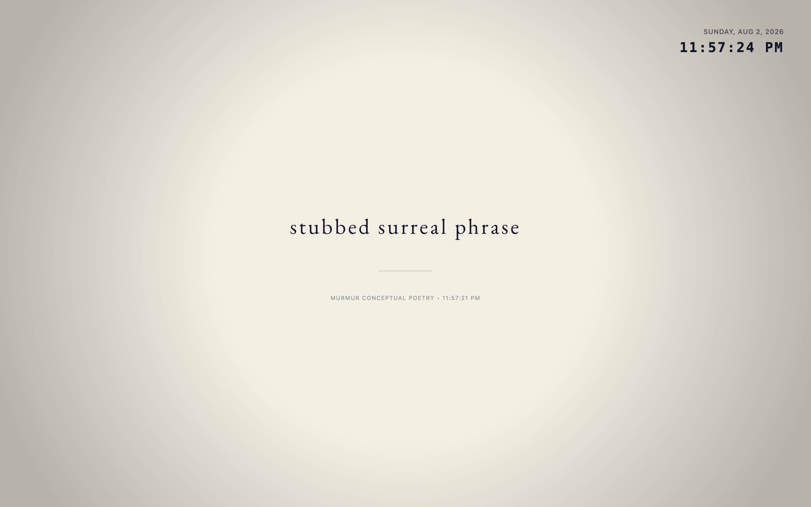

# Murmur

<div align="center">


*The world's noise, distilled into one quiet sentence. Every hour. On your desktop.*

[](LICENSE)
[](https://github.com/mbaiges/murmur/releases)
[](#download)

<br />



</div>

**Murmur** is a desktop app for **Windows and macOS** that reads RSS headlines from feeds you choose, synthesizes them with **Google Gemini**, and shows the result as living wallpaper—refreshed on a schedule, controlled from the system tray.

## What it does

- Pulls titles from your RSS feeds on a timer you set
- Generates a short phrase (plain or layout-aware “magazine” styles) via Gemini
- Renders on one or more displays with moods, fonts, themes, and animations
- Runs in the **tray** with a settings window for feeds, voice, style, and history
- Keeps phrase **history** locally per display

## Quick start (after install)

1. Install from [GitHub Releases](https://github.com/mbaiges/murmur/releases) (see [Getting started](docs/user/getting-started.md) for SmartScreen / Gatekeeper steps).
2. On first launch, complete the **setup wizard**: [Gemini API key](https://aistudio.google.com/apikey) and at least one RSS URL.
3. Click **Start Murmur**—the app moves to the tray; open **Settings** from the tray menu.
4. Pick a look under **Style**, then use **Refresh Now** in the sidebar to generate your first phrase.

<p align="center">
  
</p>

## Download

| Platform | Install | Updates |
|----------|---------|---------|
| **Windows** | Run the `.exe` installer (*More info → Run anyway* if SmartScreen warns) | In-app from **Settings → General** (unsigned builds) |
| **macOS** | Open the `.dmg`, drag Murmur to Applications; first launch: *right-click → Open* | App checks GitHub; install by replacing from a new `.dmg` |

Builds are **unsigned** (no paid Apple/Windows certificates). Details: [unsigned releases](docs/features/app-auto-update/unsigned-releases.md).

**Requirements:** Windows or macOS, network access, and your own **Google Gemini API key** (stored locally on your machine).

## Configuration

Settings are grouped by task:

| Tab | Purpose |
|-----|---------|
| **General** | API key, refresh interval, launch at login, app version / updates |
| **News sources** | RSS feed URLs |
| **Voice & prompts** | Presets, tone, language, system prompt |
| **Style** | Aesthetic moods and appearance |
| **History** | Past phrases per display |

See [Configuration guide](docs/user/configuration.md) and the screenshots below.

<p align="center">
  
  &nbsp;
  
</p>

## Documentation

- [Documentation index](docs/README.md)
- [Getting started](docs/user/getting-started.md) — install, first run, updates, privacy
- [Configuration](docs/user/configuration.md) — tabs, displays, moods
- [Architecture](docs/architecture.md) — for contributors (layout, tests, IPC)

Product and engineering specs live under [`docs/features/`](docs/features/) (spec-driven development).

## Development

Requires **Node.js 20** and npm.

```bash
git clone https://github.com/mbaiges/murmur.git
cd murmur
npm ci
npm run dev
```

Run tests: `npm run lint`, `npm run test:unit`, and `env -u ELECTRON_RUN_AS_NODE npm run test:e2e`. See [CONTRIBUTING.md](CONTRIBUTING.md).

Refresh README screenshots: `npm run docs:screenshots`.

## Status

Active development.

## License

[BSD 3-Clause](LICENSE) — permissive use with attribution; names may not be used to endorse derived products without permission.
