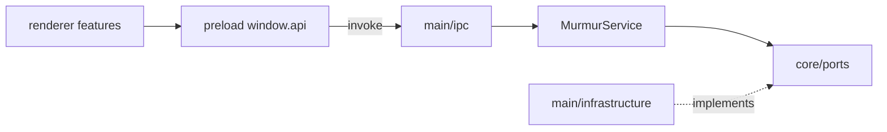

# Murmur — architecture & maintainer guide

This document is the **source of truth** for how the Murmur desktop app is structured, how process boundaries work, and how to extend features safely. Product delivery specs live under `docs/features/<feature>/`. End-user docs: [docs/README.md](README.md).

## Product shape

Murmur is a **single Electron app** (tray + settings window + per-monitor wallpaper surfaces):

1. On a schedule, fetch RSS headlines from configured feeds.
2. Call **Gemini** with a configurable system prompt (and layout-specific structured JSON when using magazine layouts).
3. Show the result on the desktop via a **live overlay** (`WallpaperView`) and/or **painted PNG** wallpapers on the native desktop.

**Settings** — React dashboard in the settings `BrowserWindow`. **Wallpaper** — same renderer bundle with `?view=wallpaper&monitorId=…`.

There is **no bundled HTTP API** in v1; all IO is local (filesystem, RSS, Gemini, OS wallpaper APIs). A future cloud service would add new **ports** and **infrastructure** adapters, not a second runtime in this repo.

## Repository layout

### Production (`src/`)

```text
src/
├── core/
│   ├── domain/          # MurmurService, Scheduler, types, config.schema, prompts
│   ├── ports/           # IConfigStore, IWallpaperRenderer, IPhraseGenerator, …
│   └── lib/
│       ├── layout/      # layoutContentSpecs, parse, preview, Zod validation
│       ├── phrase/      # plain text, markup flags, layout split
│       ├── presets/     # promptPresets, appearanceRegenerate, clickbaitPreset
│       └── generation/  # StructuredPhrasePromptBuilder, geminiFormattingRules
├── main/
│   ├── index.ts         # Lifecycle, tray, state; thin entry
│   ├── configureAppBranding.ts
│   ├── lib/             # resolveBrandIcon (Electron/fs — not in core)
│   ├── bootstrap/       # composition-root, e2e-overrides
│   ├── ipc/             # register-ipc, handlers (e.g. config-save orchestration)
│   ├── windows/         # settings + background wallpaper windows
│   ├── infrastructure/  # Adapters (config, RSS, Gemini, canvas, wallpaper, tray, startup)
│   └── e2e/             # MURMUR_E2E-only stubs (e.g. structured phrase stub)
├── shared/
│   └── ipc-contract.ts  # IpcChannel constants only
├── preload/
│   └── index.ts         # contextBridge → window.api
└── renderer/
    ├── main.tsx, index.html, index.css, public/
    ├── types/window-api.d.ts
    ├── app/AppShell.tsx
    └── features/
        ├── settings/    # SettingsShell, tabs/, hooks/, components/
        ├── moods/       # MoodsTab
        └── wallpaper/   # WallpaperView
```

### Tests (mirror `src/`)

```text
tests/
├── unit/
│   ├── core/domain/
│   ├── core/lib/
│   └── main/infrastructure/{canvas,config,history,startup,wallpaper}/
├── integration/core/
└── e2e/                 # Playwright + helpers; unchanged role
```

**Rule:** `tests/unit/.../Foo.test.ts` corresponds to `src/.../Foo.ts` (or the adapter under the same folder name).

### Root assets

| Path | Role |
|------|------|
| `resources/` | Packaged fonts, app icons, `bin/WallpaperHelper.exe` (Windows) |
| `scripts/` | Dev launcher (`run-dev.mjs`), tooling |
| `renderer/public/logo.png` | Settings UI logo in dev/build (not the same as tray icons in `resources/`) |

## Process model & import rules

| Process | May import | Must not import |
|---------|------------|-----------------|
| **Main** | `@core/*`, `@main`, `@shared/ipc`, infrastructure | — |
| **Preload** | `@core/domain`, `@core/lib` (pure), `@shared/ipc` | `@core/ports`, `@main/**`, infrastructure |
| **Renderer** | `@core/domain`, `@core/lib`, `@shared/ipc`, feature UI | `@core/ports`, `@main/**`, infrastructure |

**Enforcement:** `npm run lint` — ESLint `no-restricted-imports` on `src/renderer/**` and `src/preload/**` (see `eslint.config.mjs`).

### Path aliases

Configured in `electron.vite.config.mts`, `tsconfig.json`, and `vitest.config.ts`:

| Alias | Target | Main | Preload | Renderer |
|-------|--------|------|---------|----------|
| `@core/domain` | `src/core/domain` | yes | yes | yes |
| `@core/lib` | `src/core/lib` | yes | yes | yes |
| `@core/ports` | `src/core/ports` | yes | no | no |
| `@main` | `src/main` | yes | no | no |
| `@shared/ipc` | `src/shared/ipc-contract.ts` | yes | yes | yes |

Renderer and preload bundles must **not** expose aliases that resolve infrastructure into the client bundle.

## Call flows

### Happy path: refresh



### `config:save` (orchestrated in main)

Saving settings is **not** a single service call. `main/ipc/handlers/config-save.ts` persists config, toggles **launch-at-login**, starts/stops the **scheduler**, manages **background wallpaper windows** when animation mode changes, runs **appearance regenerate** vs re-render-only paths, and broadcasts **`config:updated`** / related state to settings and wallpaper windows.

Channel names are defined once in `src/shared/ipc-contract.ts`; preload mirrors them when exposing `window.api`.

## Wallpaper rendering & backup

### Two display paths

1. **Live overlay** — transparent `BrowserWindow` (`type: 'desktop'` on macOS; WorkerW injection on Windows). Renders `WallpaperView` with CSS animations.
2. **Static paint** — `NodeCanvasWallpaperPainterAdapter` → PNG; `MacDesktopWallpaperAdapter` / `WinDesktopWallpaperAdapter` set OS wallpaper.

When `animation === 'Instant'` on **Windows**, overlay windows are torn down and only static paint is used. On **macOS**, the overlay is kept so phrases remain visible reliably.

### Backup / restore

| Piece | Role |
|-------|------|
| **`IWallpaperRenderer`** | Port: `backup()`, `restore()`, `set()`, `getScreens()` |
| **Mac/Win desktop adapters** | Implement backup under `userData` (JSON + copied files / helper exe on Windows) |
| **`main/index.ts` lifecycle** | `backup()` after ready; `restore()` on real quit (skips dev hot-reload unless user requested quit) |

Do not use a separate wallpaper-backup port; backup is part of **`IWallpaperRenderer`**.

## Composition

- **`buildAppContext()`** in `main/bootstrap/composition-root.ts` — wires real adapters and `MurmurService`.
- **`bootstrap/e2e-overrides.ts`** — when `MURMUR_E2E`, substitutes RSS/phrase/wallpaper behavior for Playwright.
- **IPC** — `registerIpcHandlers()` in `main/ipc/register-ipc.ts`.
- **Windows** — `main/windows/settings-window.ts`, `background-windows.ts`.

Domain logic stays in **`core/`**; Electron and Node IO stay in **`main/infrastructure/`**.

## Renderer conventions

- **Routing:** `App.tsx` → `?view=wallpaper` → `features/wallpaper/WallpaperView`; else `features/settings/SettingsShell`.
- **Settings chrome:** `app/AppShell.tsx` (title bar, sidebar slot, main). macOS uses hidden title bar + traffic-light padding.
- **Moods:** `features/moods/MoodsTab.tsx` + `useMoodChange` hook (coordinated prompt, theme, font, layout, animation).
- **Layouts:** `layoutStyle` on config; implement in **both** `WallpaperView` (CSS) and `NodeCanvasWallpaperPainterAdapter` (canvas). New layouts need stable **`data-testid`** on layout roots for E2E.
- **Phrase markup:** `**bold**`, `*italic*`, `[font:…]` — shared parsing in `@core/lib/phrase/*`.

Typed **`window.api`:** `src/renderer/types/window-api.d.ts`.

## Data on disk

| File | Adapter |
|------|---------|
| `userData/murmur.config.json` | `JsonConfigStoreAdapter` |
| `userData/murmur.history.json` | `JsonHistoryStoreAdapter` |

Config migrations (e.g. Clickbait Press) run in the config adapter on read with optional write-back.

## Testing

| Tier | Command | Notes |
|------|---------|--------|
| Lint | `npm run lint` | Process boundaries on renderer/preload |
| Unit | `npm run test:unit` | Mirrored under `tests/unit/` |
| Integration | `npm run test:integration` | `tests/integration/core/pipeline.test.ts` |
| E2E | `env -u ELECTRON_RUN_AS_NODE npm run test:e2e` | Build first; uses `_electron` |

**In-loop smoke (restructure):** `npm run test:e2e:repo-restructure` → `tests/e2e/murmur.spec.ts`.

### E2E stub mode

With `MURMUR_E2E=true`, main uses **`e2e-overrides`** (stub RSS, phrase generation, wallpaper IO). Structured layout demos use **`main/e2e/e2eStructuredPhraseStub.ts`**.

**Exception:** specs that intentionally run live Gemini (e.g. captured-phrase fixture flows) omit stub env; some are CI/platform gated.

### Screenshot artifacts

Intentional captures belong under:

```text
tests/e2e/artifacts/screenshots/{test-case-slug}/{filename}.png
```

Use `e2eScreenshotPath()` from `tests/e2e/helpers/screenshotPaths.ts`. The `artifacts/` tree is gitignored.

**Committed README / user-doc captures:** `assets/screenshots/` via `npm run docs:screenshots` (see [screenshots.md](screenshots.md)).

## Build & dev

- **Dev:** `npm run dev` → `scripts/run-dev.mjs` (unset `ELECTRON_RUN_AS_NODE` in embedded terminals when needed).
- **Build:** `npm run build` → `out/main`, `out/preload`, `out/renderer`.
- **Dist:** `npm run dist` / electron-builder (installers under `dist/`).

## Adding a feature (checklist)

1. **Domain / ports** — types and interface in `core/` if new behavior crosses IO.
2. **Infrastructure** — adapter under `main/infrastructure/<area>/`.
3. **Bootstrap** — register adapter in `composition-root.ts` (and E2E overrides if test-visible).
4. **IPC** — add channel to `shared/ipc-contract.ts`; handler in `main/ipc/`; expose on preload `window.api`.
5. **Renderer** — new or extended feature under `renderer/features/`.
6. **Wallpaper parity** — if user-visible on desktop, update **both** `WallpaperView` and canvas painter.
7. **Tests** — unit beside mirrored path; E2E if UI/layout; screenshots per convention above.

### Common edits

| Change | Touch |
|--------|--------|
| New prompt preset | `core/domain/prompts.ts`, `core/lib/presets/promptPresets.ts`, Feeds tab preset select |
| New mood | `MoodsTab`, `useMoodChange`, `moodPresetLabel.ts`, Appearance mood select |
| New layout | `LayoutStyleName`, layout spec + Zod, `WallpaperView`, canvas painter, Appearance select, E2E `data-testid` |

## Structured phrase content

Layout-aware generation: registry in `core/lib/layout/layoutContentSpecs.ts`, validation in `layoutSpecToZod.ts`, prompts in `StructuredPhrasePromptBuilder.ts`. `MurmurService` uses `IPhraseGenerator.generateStructured`. State holds `lastContent` per monitor; history stores JSON envelopes (legacy plain strings still parse).

Product specs: [features/structured-phrase-generation/](features/structured-phrase-generation/).

Restructure delivery specs: [features/repo-restructure/](features/repo-restructure/).

## Related docs

| Doc | Purpose |
|-----|---------|
| [README.md](../README.md) | User-facing landing page |
| [docs/README.md](README.md) | Documentation map (user vs maintainer) |
| [CONTRIBUTING.md](../CONTRIBUTING.md) | Dev setup and PR expectations |
| [agent-skills-setup.md](agent-skills-setup.md) | Local open-agent-skills under `.agentic/` |
| [screenshots.md](screenshots.md) | README screenshot capture |
| [features/repo-restructure/](features/repo-restructure/) | Locked layout / AC for this restructure |
| [features/structured-phrase-generation/](features/structured-phrase-generation/) | Structured JSON phrase AC |
| [scaffolding/](scaffolding/) | **Superseded** early drafts — see notices in those files |

Prefer **small diffs**, existing adapter patterns, and **renderer + canvas parity** for anything visible on the wallpaper.
