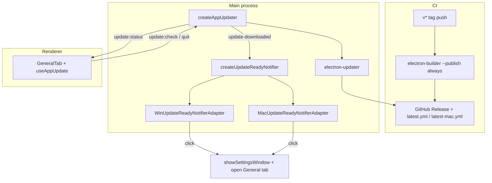

# Technical Spec: In-app auto-update

| Field | Value |
|-------|-------|
| Status | **Draft — ready for loop-build** |
| Author | Murmur engineering |
| Created | 2026-08-02 |
| Updated | 2026-08-02 |
| Product spec | [functional-spec.md](./functional-spec.md) |
| Related | [architecture.md](../../architecture.md) |

## Summary

Ship **electron-updater** against **GitHub Releases**, with CI publishing signed-ready artifacts and metadata. The main process owns checks, download, and quit-to-install (after wallpaper restore). The renderer shows status in **Settings → General**. When a download completes, **platform-specific notifiers** (port + adapters) alert the user once; clicking focuses Murmur and opens **General**.

**Complexity:** Medium (main-process updater + quit integration + two notification adapters + release CI).

**Infrastructure (v1, locked):**

| Item | Choice |
|------|--------|
| Update feed | GitHub Releases (`publish.provider: github`) |
| Updater library | `electron-updater` (pairs with `electron-builder`) |
| CI | GitHub Actions on `v*` tags, matrix macOS + Windows |
| Channels | Stable only (`allowPrerelease: false`) |
| Version selection | Latest stable on feed (semver compare → single hop) |

## Engineering principles (applied)

| Principle | Application |
|-----------|-------------|
| Port / adapter | `IUpdateReadyNotifier` + Win/Mac adapters (same layout as `IStartupIntegration`, wallpaper adapters) |
| Main owns side effects | Updater, notifications, quit/install only in main |
| IPC contract | Shared channel names in `src/shared/ipc-contract.ts`; payloads in `src/shared/app-update.ts` |
| E2E safety | `shouldEnableAppUpdate(app.isPackaged, isMurmurE2e())` disables feed + notifications |
| Fail open for UX | Notification failure must not block Settings status or download |

## Architecture



```text
Quit (install): user Restart → app.quit() → before-quit wallpaper restore → autoUpdater.quitAndInstall()
Quit (normal):  tray Quit → before-quit wallpaper restore → app.exit(0)
```

## Module map

| Path | Role |
|------|------|
| `src/shared/app-update.ts` | `AppUpdateInfo`, `AppUpdatePhase`, `shouldEnableAppUpdate`, releases URL |
| `src/shared/ipc-contract.ts` | `update:*`, `settings:open-tab` (new) |
| `src/core/ports/IUpdateReadyNotifier.ts` | **New** port |
| `src/main/infrastructure/update/createAppUpdater.ts` | Updater lifecycle, timers, deduped notify hook |
| `src/main/infrastructure/update/WinUpdateReadyNotifierAdapter.ts` | **New** Windows presentation |
| `src/main/infrastructure/update/MacUpdateReadyNotifierAdapter.ts` | **New** macOS presentation |
| `src/main/infrastructure/update/createUpdateReadyNotifier.ts` | **New** factory (`win32` / `darwin` / no-op) |
| `src/main/ipc/handlers/app-update.ts` | IPC handlers |
| `src/main/index.ts` | Wire updater, notifier, broadcast, `before-quit` |
| `src/preload/index.ts` + `renderer/types/window-api.d.ts` | Expose update + optional `onSettingsOpenTab` |
| `src/renderer/features/settings/hooks/useAppUpdate.ts` | Subscribe to `update:status` |
| `src/renderer/features/settings/tabs/GeneralTab.tsx` | Version, status, actions |
| `src/renderer/features/settings/SettingsShell.tsx` | Listen for `settings:open-tab` → `general` |
| `.github/workflows/release.yml` | Tag builds |
| `package.json` `build.publish` + mac `zip` target | Feed metadata |

### Implementation status (loop-build baseline)

| Area | Status |
|------|--------|
| Shared types, IPC update channels, `createAppUpdater`, General UI, publish config, release workflow | **Present** |
| `IUpdateReadyNotifier` + Win/Mac adapters + notify on `update-downloaded` | **Done** |
| `settings:open-tab` IPC + SettingsShell handler | **Done** |
| Maintainer signing doc (`release-runbook.md`) | **Done** |
| Unit test `shouldEnableAppUpdate` | **Present** |

## Updater behavior (`createAppUpdater`)

| Setting | Value | Rationale |
|---------|-------|-----------|
| `autoDownload` | `true` | Functional: automatic download |
| `autoInstallOnAppQuit` | `false` | User-initiated restart only |
| `allowPrerelease` | `false` | Stable-only channel |
| Initial check delay | **30s** after `app.whenReady` | Avoid startup contention with wallpaper init |
| Periodic interval | **4 hours** | Functional AC 3 |
| Enabled when | `app.isPackaged && !isMurmurE2e()` | Functional AC 9 |

**Latest stable (AC 12):** GitHub provider exposes the newest release matching channel rules; `electron-updater` compares `app.getVersion()` to that release’s version and downloads it directly (no stepping through intermediate tags).

Events → `AppUpdateInfo.phase`:

| electron-updater event | Phase |
|------------------------|-------|
| `checking-for-update` | `checking` |
| `update-available` | `available` |
| `update-not-available` | `not-available` |
| `download-progress` | `downloading` (+ `downloadPercent`) |
| `update-downloaded` | `downloaded` (+ notify once) |
| `error` | `error` |

On each state change, main sends `IpcChannel.updateStatus` to the settings `BrowserWindow` if it exists.

**Notify dedupe (AC 5):** Keep `lastNotifiedVersion: string | null` in the updater module. On `update-downloaded`, call `notifier.show({ version })` only if `version !== lastNotifiedVersion`, then set the flag. Do not re-notify on periodic checks while still on the same downloaded version.

## Port: `IUpdateReadyNotifier`

```typescript
export type UpdateReadyNotification = {
  version: string
}

export interface IUpdateReadyNotifier {
  /** Platform-native non-modal alert; must not throw if OS denies notifications. */
  notifyReadyToInstall(payload: UpdateReadyNotification): void
  /** Register handler when user activates the notification (main: show Settings + General tab). */
  setActivationHandler(handler: () => void): void
}
```

**Factory** `createUpdateReadyNotifier(deps)` in main (not core domain — uses Electron APIs):

| Platform | Adapter | Mechanism |
|----------|---------|-----------|
| `win32` | `WinUpdateReadyNotifierAdapter` | Prefer `Tray.displayBalloon` when tray instance is available (injected from `ElectronTrayAdapter` or main); fallback `Notification` from `electron` |
| `darwin` | `MacUpdateReadyNotifierAdapter` | `Notification` from `electron`; call `Notification.isSupported()`; no-op if false |
| other | No-op implementation | Linux / unsupported |

**Copy (product-consistent, implementation detail):**

- Title: `Murmur update ready`
- Body: `Version {version} is downloaded. Restart to install.`

**Activation (Journey G):** `setActivationHandler(() => { showSettingsWindow(); sendSettingsOpenTab('general') })`.

Errors from notification APIs: log at `warn`, do not set updater phase to `error`.

## IPC

### Update (existing)

| Channel | Direction | Payload |
|---------|-----------|---------|
| `update:get` | invoke → main | → `AppUpdateInfo` |
| `update:check` | invoke → main | → `AppUpdateInfo` |
| `update:quit-and-install` | invoke → main | void |
| `update:status` | main → renderer | `AppUpdateInfo` |

Preload: `getUpdateInfo`, `checkForUpdates`, `quitAndInstallUpdate`, `onUpdateStatus`.

### Settings navigation (new)

| Channel | Direction | Payload |
|---------|-----------|---------|
| `settings:open-tab` | main → renderer | `'general'` (extend union if needed later) |

Preload: `onSettingsOpenTab(callback: (tab: 'general') => void): () => void`.

SettingsShell: on event, `persistUi({ activeTab: 'general' })` (or equivalent state setter used today).

## Renderer

- **GeneralTab** — already wired via `useAppUpdate`; no change required for AC 1/4/7/8 beyond tab-open listener.
- **Manual download** — `openExternal(MURMUR_RELEASES_URL)` (AC 8).

## Build and release

### `package.json` / electron-builder

```json
"publish": { "provider": "github", "owner": "mbaiges", "repo": "murmur" },
"mac": { "target": ["dmg", "zip"] },
"win": { "target": "nsis" }
```

macOS **zip** is required for auto-update; DMG remains for manual installs.

### CI (`.github/workflows/release.yml`)

- Trigger: push tags `v*`
- Matrix: `macos-latest`, `windows-latest`
- Command: `npm run dist -- --publish always`
- `GH_TOKEN: ${{ secrets.GITHUB_TOKEN }}`

### Maintainer runbook (AC 10–11)

Add `docs/features/app-auto-update/release-runbook.md`:

1. Bump `version` in `package.json` to match tag (e.g. `0.2.0`).
2. Commit, tag `v0.2.0`, push tag — CI publishes artifacts.
3. Mark GitHub Release as **latest** stable (not pre-release).
4. Configure repo secrets for production:

| Secret | Purpose |
|--------|---------|
| `CSC_LINK`, `CSC_KEY_PASSWORD` | Windows Authenticode (+ optional mac cert bundle) |
| `APPLE_ID`, `APPLE_APP_SPECIFIC_PASSWORD`, `APPLE_TEAM_ID` | macOS notarization |

5. Smoke test: install previous release → confirm update to new tag → restart → version string.

Local publish: `GH_TOKEN=<PAT repo scope> npm run dist -- --publish always`.

## Security checklist

- [ ] No tokens in repo or client bundle (`GH_TOKEN` CI-only; public feed needs no client secret).
- [ ] `electron-updater` signature verification enabled by default on signed builds.
- [ ] Update IPC handlers validate nothing sensitive; no arbitrary URL install.
- [ ] Notifications contain version only, no user config or API keys.

## Testing

| Layer | Scope |
|-------|--------|
| Unit | `shouldEnableAppUpdate`; optional `createUpdateReadyNotifier` returns no-op when disabled |
| Unit | Dedupe helper: `shouldNotifyForVersion(last, next)` pure function if extracted |
| Integration | Mock `autoUpdater` events → notifier called once per version (main, optional) |
| E2E | **No** live GitHub; updater disabled via E2E mode (existing suites unchanged) |
| Manual | Packaged build + two tagged releases; notification click opens General; restart upgrades |

## Implementation phases

| Phase | Deliverable |
|-------|-------------|
| **1 — Updater core** | Done: types, IPC, `createAppUpdater`, General UI, publish config, workflow |
| **2 — Notifications** | Port + Win/Mac adapters, factory, wire `update-downloaded`, dedupe |
| **3 — Navigation** | `settings:open-tab` + SettingsShell + preload |
| **4 — Docs & ship** | `release-runbook.md`, first signed tag, manual smoke |

## Acceptance mapping

Functional AC from [functional-spec.md](./functional-spec.md):

| AC | Design / verification |
|----|------------------------|
| 1 | `AppUpdateInfo.currentVersion` from `app.getVersion()` in General |
| 2 | `createAppUpdater.start()` delayed check; async `checkForUpdates` |
| 3 | `PERIODIC_CHECK_INTERVAL_MS = 4h` |
| 4 | `autoDownload` + General `phase === 'downloaded'` → Restart button |
| 5 | `IUpdateReadyNotifier` on `update-downloaded`, dedupe by version; no-op if OS denies |
| 6 | Manual: restart via `quitAndInstall`; version from `package.json` / builder |
| 7 | `update:check` IPC + General button |
| 8 | `openExternal` releases URL |
| 9 | `shouldEnableAppUpdate` false → disabled phase, no notifier, no network |
| 10 | CI workflow + mac zip + win nsis + publish |
| 11 | `release-runbook.md` signing section |
| 12 | `allowPrerelease: false` + GitHub latest stable semantics (document in runbook) |

## Out of scope (technical)

- Linux notifier/updater
- Staged rollout configuration
- Custom update server
- In-app release notes parsing from GitHub API
- Auto-install on quit without user clicking Restart

## Open items (minor)

- Whether to expose update status on tray menu (functional defers to post-v1).
- Deep-link hash in URL vs IPC-only tab switch — **IPC `settings:open-tab` is v1**.

## Next step

[loop-build](../loop-build/SKILL.md): complete phases **2–4**, run unit tests, manual packaged smoke before first public release tag.
