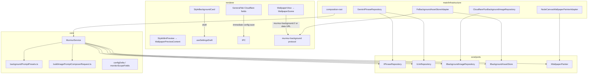

# Technical Spec: Background image (gradient, photo, AI)

| Field | Value |
|-------|-------|
| Status | **Locked** (2026-08-04) |
| Author | Murmur engineering |
| Created | 2026-08-04 |
| Updated | 2026-08-04 (phrase visibility, widgets, Absurd connections, finalizeIntegratedImagePrompt) |
| Product spec | [functional-spec.md](./functional-spec.md) |
| Related | [architecture](../../architecture.md), [style-voice-settings-polish](../style-voice-settings-polish/technical-spec.md), [per-monitor-settings](../per-monitor-settings/technical-spec.md) |

## Summary

Add **three background sources** per monitor profile (`gradient` \| `photo` \| `ai`), global **Cloudflare** credentials, **preset + custom background instructions**, optional **phrase rendered inside the FLUX image**, and a refresh pipeline step: **Gemini composes an image prompt** → **Cloudflare FLUX Schnell** returns PNG/JPEG → **filesystem asset store** caches files → **canvas painter** and **live overlay** share the same base bitmap. Follows [architecture.md](../../architecture.md): **ports** in `src/core/ports/`, **adapters** in `src/main/infrastructure/<area>/`, wiring in **`composition-root.ts`**, IPC in **`shared/ipc-contract.ts`** + **`main/ipc/handlers/`**, orchestration in **`MurmurService`**. Config bumps to **`configVersion: 3`**.

**Complexity:** High (config migration, refresh pipeline, painter + overlay parity, custom media protocol, Settings draft fields, E2E stubs).

**Infrastructure (v1, locked):**

| Area | Decision |
|------|----------|
| Runtime | Existing Electron app |
| Image provider | **Cloudflare Workers AI** REST `@cf/black-forest-labs/flux-1-schnell` |
| Image prompt | **`ILlmRepository.completeText`** via **`GeminiPhraseRepository`** (same API key / **`gemini-3.1-flash-lite`** as structured phrases) |
| Asset storage | **`userData/backgrounds/`** via **`IBackgroundAssetStore`** + **`FsBackgroundAssetStoreAdapter`** (same *Store* naming as `IHistoryStore` / `JsonHistoryStoreAdapter`) |
| Config | **`configVersion: 3`**; chain **`migrateRawConfigToLatest()`** in `core/lib/config/configMigrate.ts` (v1/v2 → v2 → v3); Zod in **`core/domain/config.schema.ts`** |
| Overlay media | Custom protocol **`murmur-background://bg/{monitorId}/{kind}`** (+ legacy hostname) registered from main (`registerBackgroundProtocol.ts`); renderer may load bitmaps via **`background:dataUrl`** IPC when protocol/CSS is unreliable |
| IPC | New channels in **`ipc-contract.ts`**; handlers in **`main/ipc/handlers/background-photo.ts`**, **`background-data-url.ts`**; wired in **`register-ipc.ts`**; exposed on **`preload/index.ts`** + **`renderer/types/window-api.d.ts`** |
| Draft | Extend **`DRAFT_FIELD_KEYS`**, **`VISUAL_SCALAR_KEYS`**, **`STYLE_KEYS`** (`monitorScopeFields.ts`), **`pickDraftFields`**, **`settingsDraftSession.ts`** |
| General tab | **Immediate** partial `saveConfig` (same pattern as `geminiApiKey` in `GeneralTab.tsx`) |
| E2E | Extend **`e2e-overrides.ts`** + **`e2eGenerationCounter.ts`** (separate tallies for image prompt vs provider); no live Cloudflare in CI |
| New npm deps | None (**`sharp`** already in `package.json`; first use in canvas painter for cover-crop) |

## Engineering principles (applied)

| Principle | Application |
|-----------|-------------|
| Product spec is truth | Refresh coupling, overlay parity, phrase-fail skip, PNG/JPEG only |
| Hexagonal boundaries | `MurmurService` depends on ports; Cloudflare/Gemini/FS only in main adapters |
| Fail closed | Invalid photo, missing Cloudflare creds in AI mode → fallback + `lastGenerationError` / banner |
| Minimal IPC | One new pick-photo channel; credentials via existing `config:save` |
| Swappable provider | `IBackgroundImageRepository` enables future providers without UI change |
| E2E as contract | Feature spec + stubs via **`createE2eRuntimeAdapters()`** (same pattern as RSS/phrase/wallpaper) |

## Alignment with repository architecture

This feature must follow the [Adding a feature checklist](../../architecture.md#adding-a-feature-checklist):

| Step | This feature |
|------|----------------|
| Domain / ports | **`ILlmRepository`**, **`IPhraseRepository`**, **`IBackgroundImageRepository`**, **`IBackgroundAssetStore`** |
| Infrastructure | `main/infrastructure/gemini/`, `cloudflare/`, `background/`, `media/` adapters |
| Bootstrap | Register in `buildAppContext()`; E2E stubs from `e2e-overrides.ts` injected into `MurmurService` |
| IPC | Constants in `src/shared/ipc-contract.ts`; handler module; preload `window.api` |
| Renderer | Extend `StyleBackgroundCard`, `GeneralTab`; draft via existing `useSettingsDraft` / `SettingsApplyBar` |
| Wallpaper parity | **`WallpaperScene`** + **`WallpaperPreviewContent`** (mini preview) **and** `NodeCanvasWallpaperPainterAdapter` |
| Tests | Mirror paths under `tests/unit/`; E2E `tests/e2e/background-image.spec.ts`; screenshots via `e2eScreenshotPath()` |

**Import rules (unchanged):** Renderer/preload may import `@core/domain` and `@core/lib` only — no `@core/ports` or `@main/**`. Bitmap paths reach the renderer as **`murmur-background://`** URLs and/or **`background:dataUrl`** responses (base64 data URLs), not raw absolute filesystem paths in React state.

**Persistence pattern:** Config JSON via `JsonConfigStoreAdapter`; binary assets **outside** config file under `userData/backgrounds/` (like wallpaper backup files, not like phrase history text).

**`config:save` orchestration:** Centralized in `main/ipc/handlers/config-save.ts` — **`ensureMonitorsForScreens`** before persist; background profile changes use **`classifyConfigDelta`** → `reRenderWallpapers` vs `refresh()`. When **`hasAiBackgroundSettingsDelta`** (mode, preset, custom prompt, **`aiPhraseInImage`**, **`aiPhraseInImagePreset`**) and phrase regen is **not** required, main calls **`MurmurService.regenerateAiBackgrounds`** then **`reRenderWallpapers`**. Root **`cloudflareAccountId` / `cloudflareApiToken`** changes still do not force wallpaper regen from delta classifier alone.

**No new domain service file required:** Keep refresh orchestration in `MurmurService` (matches current RSS + phrase + paint loop). Pure helpers live in `@core/lib/background/` and `@core/lib/generation/`.

**Docs:** Update [architecture.md](../../architecture.md) **Data on disk** table with `userData/backgrounds/` when implementing.

## Architecture



### Module responsibilities

| Module | Responsibility |
|--------|----------------|
| `core/ports/ILlmRepository.ts` | `completeText({ userMessage }) → string` — generic single-turn LLM |
| `core/ports/IPhraseRepository.ts` | Structured phrase generation |
| `core/ports/IBackgroundImageRepository.ts` | `generate({ prompt, width, height }) → Buffer` |
| `core/ports/IBackgroundAssetStore.ts` | `importPersonalPhoto`, `saveGeneratedImage`, `resolveAbsolutePath(relPath)`, `latestAiRelPath(monitorId)` |
| `core/lib/presets/backgroundPromptPresets.ts` | Preset templates with `{{samples}}` / `{{phrase}}`, per-preset `variables[]`, mood links |
| `core/lib/presets/aiPhraseInImagePresets.ts` | In-image phrase presets; **`isAiPhraseIntegrated`**, **`shouldPaintPhraseOverlay`**, **`aiPhraseInImagePresetInstruction`** |
| `core/lib/generation/buildImagePromptComposerRequest.ts` | Pure: profile + `{ sampleTitles, phrase, voiceContext? }` → user message; integrated branch allows readable phrase text |
| `core/lib/generation/finalizeIntegratedImagePrompt.ts` | Appends mandatory verbatim phrase block to FLUX prompt when in-image phrase enabled |
| `core/lib/wallpaper/drawPhraseWidgetCanvas.ts` | Phrase caption layout + font measurement for static paint |
| `core/lib/background/resolveBackgroundBase.ts` | Pure: profile + resolved paths → `{ backgroundMode, baseImagePath?, fallbackTheme }` |
| `core/lib/config/defaultMonitorProfile.ts` | Defaults for new background fields |
| `core/lib/config/configMigrate.ts` | **`migrateRawConfigToLatest`**: existing v2 migration, then v3 profile/root fields |
| `core/lib/presets/configDelta.ts` | Add keys to `DRAFT_FIELD_KEYS`, `VISUAL_SCALAR_KEYS`; extend `pickDraftFields` / `profilesEqual` |
| `core/lib/config/monitorScopeFields.ts` | Add background keys to **`STYLE_KEYS`** (style tab sync mesh) |
| `core/domain/config.schema.ts` + `config-types.ts` | Zod + TS types for v3 |
| `main/infrastructure/gemini/GeminiPhraseRepository.ts` | Implements **`IPhraseRepository`** and **`ILlmRepository`** |
| `main/infrastructure/cloudflare/CloudflareFluxBackgroundImageRepository.ts` | Cloudflare FLUX |
| `main/infrastructure/background/FsBackgroundAssetStoreAdapter.ts` | Files under `userData/backgrounds/{monitorId}/` |
| `main/infrastructure/media/registerBackgroundProtocol.ts` | `protocol.registerFileProtocol` (or buffer) with path jail |
| `main/infrastructure/canvas/NodeCanvasWallpaperPainterAdapter.ts` | `drawBackground` branch: sharp cover-crop when `baseImagePath` set |
| `main/ipc/handlers/background-photo.ts` | `dialog.showOpenDialog`, import copy via store |
| `core/domain/MurmurService.ts` | Extend private `paintOptionsFromProfile`; inject 3 ports in constructor |
| `renderer/features/settings/components/StyleBackgroundCard.tsx` | Mode UI (extend existing card) |
| `renderer/features/settings/components/StylePhraseCard.tsx` | AI chips: overlay / in-image / **hidden**; in-image presets; gradient/photo center headline |
| `renderer/features/wallpaper/BottomPhraseWidget.tsx` | Live overlay phrase caption with auto font shrink |
| `renderer/features/settings/tabs/HistoryTab.tsx` | Refetch history when **`lastRefreshTime`** changes |
| `main/lib/notifySettingsToast.ts` | Push Settings toasts only when window visible and not minimized |
| `renderer/features/settings/tabs/GeneralTab.tsx` | Cloudflare fields + immediate `saveConfig` |
| `renderer/features/wallpaper/WallpaperScene.tsx` | Base layer: gradient CSS vs `murmur-background://` |
| `renderer/features/wallpaper/WallpaperPreviewContent.tsx` | Same base-layer rules for mini preview |

## Auth & authorization

Local desktop only. **`murmur-background://`** must reject paths outside `userData/backgrounds` (fail closed).

## HTTP API

None in-app. Outbound:

| Target | Method | Purpose |
|--------|--------|---------|
| `https://api.cloudflare.com/client/v4/accounts/{id}/ai/run/@cf/black-forest-labs/flux-1-schnell` | POST | Text-to-image |
| Gemini Generative Language API | POST | Image prompt composition (via `@google/genai`) |

## Realtime / IPC

| Channel | Change |
|---------|--------|
| `config:get` / `config:save` | Payload **`configVersion: 3`**; root `cloudflareAccountId`, `cloudflareApiToken`; profile background fields. **`JsonConfigStoreAdapter.set`** shallow-merge unchanged. |
| `config:updated` | Unchanged broadcast to settings + background windows |
| **`background:pickPhoto`** | Handler in `background-photo.ts`; `dialog.showOpenDialog` filters **png/jpeg/jpg**; returns `{ canceled, filePath? }` |
| **`background:importPhoto`** | Copies into store; returns `{ relPath }`; invoked from Apply flow before persisting profile |
| **`background:dataUrl`** | `{ monitorId, kind: 'personal' \| 'ai' }` → data URL string or null; reads latest `personal.*` / `ai-latest.{png,jpg}` via asset store |
| `action:refresh` | Unchanged → `MurmurService.refresh()` |
| `action:previewTheme` | **Unchanged semantics:** temporary **gradient** theme override for preview paint only; does not fetch AI or change photo |
| `state:updated` | Reuse **`lastGenerationError`** (no new state field in v1) |

**Preload** (`preload/index.ts`): `pickBackgroundPhoto()`, `importBackgroundPhoto({ monitorId, sourcePath })`, **`getBackgroundDataUrl(monitorId, kind)`**.

**Types:** `renderer/types/window-api.d.ts` mirrors preload.

**E2E-only IPC (optional):** extend `e2eGenerationCounter` exposure with `e2e:backgroundPipelineCountsGet` returning `{ imagePrompt, provider }` when `isMurmurE2eMode()` — same gating as `e2e:generationCountGet`.

## Data model

### Config versioning

- **`configVersion: 3`**
- In **`configMigrate.ts`**, add **`migrateRawConfigToV3(config: MurmurConfig): MurmurConfig`** and export **`migrateRawConfigToLatest(parsed: LegacyRoot): MurmurConfig`**:
  1. `migrateRawConfigToV2(parsed)` (existing)
  2. If `configVersion < 3`, bump version and default new fields on root + each `monitors[].profile`
- **`JsonConfigStoreAdapter.get()`**: call `migrateRawConfigToLatest`; write-back when version or clickbait-style fixes mark `dirty` (same pattern as v2 today)
- **`getDefaultConfig()`** / **`getDefaultMonitorProfile()`**: include v3 defaults (`backgroundMode: 'gradient'`, etc.)

**v3 defaults on migrate:** `backgroundMode: 'gradient'`, `backgroundPresetId: 'Abstract mood'`, `customBackgroundPrompt: ''`, `backgroundPhotoRelPath: ''`, `cloudflareAccountId: ''`, `cloudflareApiToken: ''`.

### `MurmurConfig` (root additions)

| Field | Type | Notes |
|-------|------|-------|
| `cloudflareAccountId` | `string` | Global |
| `cloudflareApiToken` | `string` | Global secret |

### `MonitorProfile` (additions)

| Field | Type | Default | Notes |
|-------|------|---------|-------|
| `backgroundMode` | `'gradient' \| 'photo' \| 'ai'` | `'gradient'` | |
| `backgroundPresetId` | `BackgroundPresetId` | `'Abstract mood'` | Includes `'Custom'` |
| `customBackgroundPrompt` | `string` | `''` | Max **2048** chars; required non-empty when preset is Custom (Apply validation) |
| `backgroundPhotoRelPath` | `string` | `''` | Relative to `userData/backgrounds/`, e.g. `{monitorId}/personal.jpg` |
| `aiPhraseInImage` | `boolean` | `false` | When `backgroundMode === 'ai'`, FLUX renders phrase text; overlay phrase suppressed |
| `aiPhraseInImagePreset` | enum (9 values) | `'poem'` | See **`aiPhraseInImagePresets.ts`** |
| `showHeroPhrase` | `boolean` | `true` | When false, no center headline (AI **Hidden** or gradient/photo off) |

### `OverlayConfig` (extend)

| Field | Default | Notes |
|-------|---------|-------|
| `phraseWidget` | `false` | Bottom-center phrase caption |

Zod: `.superRefine` — if `backgroundMode === 'photo'`, committed profile must have resolvable `backgroundPhotoRelPath` after Apply (import step).

### Draft session (renderer)

| Field | Storage | Notes |
|-------|---------|-------|
| `pendingPhotoSourcePath` | `sessionStorage` draft blob | Absolute path from picker until Apply; not persisted in config |

On **Apply** with photo mode: renderer sends profile patch; main **imports** `pendingPhotoSourcePath` via repository and sets `backgroundPhotoRelPath`.

### Asset layout (`userData/backgrounds/`)

Document alongside `murmur.config.json` / `murmur.history.json` in architecture **Data on disk**.

```text
{userData}/backgrounds/
  {monitorId}/
    personal.jpg | personal.png   # one active personal file
    ai-latest.jpg | ai-latest.png # last successful AI generation (extension from provider bytes)
```

**`FsBackgroundAssetStoreAdapter`:** `saveGeneratedImage` picks PNG vs JPEG filename from buffer magic bytes; **`resolveLatestAiAbsolutePath`** checks both extensions.

### `PaintOptions` (extend)

| Field | Type | Notes |
|-------|------|-------|
| `backgroundMode` | `'gradient' \| 'photo' \| 'ai'` | |
| `baseImagePath` | `string?` | Absolute path to JPEG/PNG for photo/ai; painter uses **sharp** resize cover |
| `theme` | `ThemeName` | Used when `backgroundMode === 'gradient'` or **fallback** when bitmap missing |
| `shouldPaintPhraseOverlay` | derived in `paintOptionsFromProfile` | When false, canvas painter skips **`drawPhrase`** (`paintHeroPhrase: false`) |
| `paintHeroPhrase` | `boolean` on `PaintOptions` | Explicit gate for center headline vs widget-only phrase text |

### `MurmurState`

Keep **`lastGenerationError`** only (no schema change). Refresh and **`regenerateAiBackgrounds`** may set background-specific text; tray/settings copy uses combined string. **`lastRefreshTime`** bumps on successful refresh/regen so **History** and mini preview cache keys update.

### `classifyConfigDelta` (root fields)

In **`configDelta.ts`**, treat **`cloudflareAccountId`** and **`cloudflareApiToken`** like existing root connection fields: changes do **not** classify as `visual` or `content` monitor deltas (same bucket as `geminiApiKey` today — early guard returns `'none'` for wallpaper side effects).

## Background prompt presets (v1 catalog)

File: `core/lib/presets/backgroundPromptPresets.ts`

**Mood-linked** (mirror aesthetic moods):

| Id | Mood | Instruction summary |
|----|------|---------------------|
| `Cyberpunk neon haze` | Rogue Terminal | Neon city fog, no text, dark magenta/teal |
| `Zen mist` | Zen Study | Soft paper fog, minimal, muted greens |
| `Gothic violet fog` | Gothic Novelist | Purple prose atmosphere, no text |
| `Tabloid flash` | Clickbait Press | High contrast newsprint texture, no readable text |

**Standalone:**

| Id | Summary |
|----|---------|
| `Abstract mood` | Default; abstract wallpaper from headline *themes*, no text |
| `Editorial paper` | Magazine paper texture, subtle |
| `Warm film grain` | Analog warmth, soft bokeh |
| `Absurd connections` | Concepts from `{{phrase}}`; absurd surreal visuals; uses `{{samples}}` optionally |

**Custom** — uses `customBackgroundPrompt`.

Helper: `resolveBackgroundInstructions(profile) → string` (preset text or custom).

## In-image phrase presets (`aiPhraseInImagePresets.ts`)

| Id | UX label | Composer instruction theme |
|----|----------|----------------------------|
| `word-art` | Word Art | Decorative integrated typography |
| `poem` | Poem | Line breaks, literary layout |
| `book-quote` | Book Quote | Epigraph / jacket quote |
| `match-prompt-tone` | Match Prompt + Tone | Uses Voice system prompt + tone strings |
| `neon-sign` | Neon Sign | Glowing tube neon on dark scene |
| `newspaper-headline` | News Headline | Bold print headline texture |
| `graffiti-tag` | Graffiti | Spray/street lettering on wall |
| `minimalist-caption` | Minimal Caption | Small sans caption in negative space |
| `cinematic-subtitle` | Film Subtitle | Lower-third cinematic bar |

When **`aiPhraseInImage`** is true, **`buildImagePromptComposerRequest`** merges **`aiPhraseInImagePresetInstruction`** with background template resolution and **does not** append the global “no text in image” clause for the background portion. After **`ILlmRepository.completeText`**, **`finalizeIntegratedImagePrompt`** appends a mandatory verbatim phrase block to the string sent to FLUX.

**AI phrase delivery UI:** **`getAiPhraseDeliveryMode`** / **`patchForAiPhraseDeliveryMode`** map chips **overlay | in-image | hidden** to `showHeroPhrase` + `aiPhraseInImage`.

## Refresh pipeline (`MurmurService.refresh`)

Per enabled display (unchanged RSS sampling first):

```text
1. sampleHeadlines
2. try phrase = ai.generateStructured(...)
   on failure → restore prev phrase/content; continue to next monitor (skip step 3–4)
3. if profile.backgroundMode === 'ai':
     a. userMessage = buildImagePromptComposeUserMessage(profile, { sampleTitles, phrase })
     b. imagePrompt = await llm.completeText({ userMessage })
        if aiPhraseInImage: imagePrompt = finalizeIntegratedImagePrompt(imagePrompt, phrase)
     c. try buffer = await backgroundProvider.generate(...)
        on success → assetStore.saveGeneratedImage(monitorId, buffer)
        on failure → use latest ai file or theme fallback; set lastGenerationError
4. base = resolveBackgroundBase(profile, assetStore)  // pure + store path resolution in adapter
5. extend paintOptionsFromProfile(...) with baseImagePath / backgroundMode
6. painter.paint → renderer.set
```

**Locked:** Step 3 runs **only if step 2 succeeded** for that monitor.

**Cloudflare credentials:** If missing/invalid in AI mode, skip step 3c call, fallback, error message pointing to General tab.

**Parallelism:** v1 **sequential** per monitor (same as today’s generation loop) to simplify quota debugging.

## Apply / config-save

Extend **`configDelta`** / **`VISUAL_SCALAR_KEYS`** with:

- `backgroundMode`, `backgroundPhotoRelPath`, `backgroundPresetId`, `customBackgroundPrompt`, **`aiPhraseInImage`**, **`aiPhraseInImagePreset`**, **`showHeroPhrase`**

**`hasAiBackgroundSettingsDelta`:** true when any of the above AI-related profile fields change between prev/next config (per monitor merge semantics in handler).

**`reRenderWallpapers` / `updateClockWallpapers`:** Same `paintOptionsFromProfile` path — resolve photo/AI files from store using committed profile.

**`regenerateAiBackgrounds(state)`:** For each enabled AI monitor, uses cached **`lastHeadlines`** + phrase; runs **`resolveBackgroundForPaint(..., forceRegenerate: true)`**; paints desktop on success. Returns user-facing error string or undefined. Requires Cloudflare credentials; if headlines missing, returns guidance to run **Refresh Now**.

### Style tab sync mesh

Add to **`STYLE_KEYS`** in `monitorScopeFields.ts`:

`backgroundMode`, `backgroundPhotoRelPath`, `backgroundPresetId`, `customBackgroundPrompt`, **`aiPhraseInImage`**, **`aiPhraseInImagePreset`**

(Mood **`applyAestheticMood()`** does not set these — product locked.)

All background field changes are **visual-only** for phrase regeneration (do **not** add to `CONTENT_DELTA_KEYS`).

On **`config:save`** after Apply:

- **Gradient / photo** change → `reRenderWallpapers` with new base (photo import completes before save in handler or atomically in save pipeline).
- **AI** settings change → **`regenerateAiBackgrounds`** when delta detected (unless full **`refresh()`** already ran for content delta); then **`reRenderWallpapers`** using new **`ai-latest.*`** when generation succeeded, else cached file or **theme fallback**.

**Locked Apply sequence (photo):**

1. `background:importPhoto({ monitorId, sourcePath })` → `{ relPath }`
2. `config:save` with profile patch including `backgroundPhotoRelPath: relPath`, `backgroundMode: 'photo'`

(Draft holds `pendingPhotoSourcePath` in session until Apply.)

## Painting & overlay

### Canvas (`NodeCanvasWallpaperPainterAdapter`)

1. If `baseImagePath` set: load with **sharp**, resize **cover** to resolution, draw to canvas.
2. Else: existing `drawBackground(theme)`.
3. `applyNoise`, overlays, vignette, phrase when **`shouldPaintPhraseOverlay(profile)`** (unchanged layout pipeline when overlay on).

### Overlay (`WallpaperScene` / `WallpaperView`)

- Read `profile.backgroundMode` + load base bitmap:
  - `gradient` → existing CSS gradient classes
  - `photo` / `ai` → prefer **`getBackgroundDataUrl(monitorId, kind)`** IPC → `` (transparent base layer beneath grain/vignette); protocol URL remains supported for mini preview where stable
- **Phrase container:** hidden when **`!shouldPaintPhraseOverlay(profile)`** (integrated phrase mode)
- **Grain/vignette**: reuse CSS classes where possible; match painter semantics approximately for preview/overlay.

### Mini preview (Settings)

- Gradient: existing swatch classes
- Photo/AI: data URL or `murmur-background://` with **`backgroundCacheKey={lastRefreshTime}`** to bust cache after regen

## Composition root & E2E

**`buildAppContext()`** (`main/bootstrap/composition-root.ts`):

- **`GeminiPhraseRepository`** implements both repository ports; production wiring passes the same instance as `phraseRepository` and `llmRepository`
- Pass into **`MurmurService`** constructor (extend alongside existing ports)
- Optionally expose on `AppContext` type for IPC handlers (`backgroundAssetStore`)

**E2E** (`main/bootstrap/e2e-overrides.ts`):

- Extend **`createE2eRuntimeAdapters()`** with stub **`llmClient.completeText`** and **`backgroundImageProvider`**
- **`buildAppContext()`**: when `isMurmurE2eMode()`, use stubs for those ports; use **real** `FsBackgroundAssetStoreAdapter` (or temp dir under `userData`) so import/paint paths work
- Stubs call **`incrementE2eImagePromptCallCount()`** / **`incrementE2eBackgroundProviderCallCount()`** in `main/e2e/e2eGenerationCounter.ts` (phrase counter unchanged)

**Main startup:** call **`registerBackgroundProtocol()`** from `main/index.ts` during app ready (before creating settings/background windows).

## Frontend

| Surface | Work |
|---------|------|
| `StyleBackgroundCard` | **`SettingsChipGroup`** for Gradient / Photo / AI; conditional blocks; preset **`SettingsSelect`** + textarea; photo pick/clear; section chrome `bg-slate-900 border border-slate-800 rounded-xl` |
| `StylePhraseCard` | AI delivery **overlay | in-image | hidden**; dims overlay typography when hero off |
| `StyleWidgetsCard` | **`phraseWidget`** (Phrase caption, bottom center) |
| `GeneralTab` | Cloudflare fields + helper copy |
| `useSettingsDraft` | Patch new profile fields |
| `SettingsApplyBar` / `SettingsShell` | Validate Custom prompt length; show error toast from **`lastGenerationError`** on failed refresh/apply when Settings visible |
| `VoiceTab` | No change |

## Security checklist

- [ ] Never log `cloudflareApiToken` or Gemini key
- [ ] Store tokens only in `murmur.config.json` (existing pattern)
- [ ] `murmur-background://` path normalization; no directory traversal
- [ ] Cloudflare token scoped Workers AI only (user responsibility; document in UI)
- [ ] Photo import only from user-selected paths via dialog

## Deployment / environment

| Variable | Purpose |
|----------|---------|
| `GEMINI_API_KEY` | Dev/docs only; runtime uses config store |
| `MURMUR_E2E` | Stubs |
| Optional `MURMUR_IMAGE_PROMPT_MODEL` | Override composer model (default **`gemini-3.1-flash-lite`**) |

No Cloudflare env vars required when using Settings UI.

## Testing

| Layer | Scope |
|-------|--------|
| Unit | `tests/unit/core/lib/presets/backgroundPromptPresets.test.ts`, `tests/unit/core/lib/background/`, `tests/unit/core/lib/config/configMigrate.test.ts` (v3) |
| Unit | `tests/unit/core/lib/generation/buildImagePromptComposeUserMessage.test.ts` (integrated vs overlay text rules) |
| Unit | `tests/unit/main/infrastructure/cloudflare/`, `tests/unit/main/infrastructure/background/`, extend canvas painter tests |
| Integration | Extend `tests/integration/core/pipeline.test.ts` with `baseImagePath` paint smoke |
| E2E | `tests/e2e/background-image.spec.ts` + `npm run test:e2e` group; screenshots under `e2e/artifacts/screenshots/background-image/` |
| E2E | Pipeline call counts via `e2e:backgroundPipelineCountsGet` or stub hooks |

## Implementation phases

| **1** | Types, Zod v3, `migrateRawConfigToLatest`, presets, ports, `FsBackgroundAssetStoreAdapter`, protocol registration |
| **2** | Cloudflare + Gemini composer adapters; unit tests under mirrored paths |
| **3** | `MurmurService` pipeline + `paintOptionsFromProfile` + painter sharp path + `reRenderWallpapers` |
| **4** | IPC `background-photo.ts`, preload/API types, General + Style UI, draft/sync/delta keys |
| **5** | `WallpaperScene` + `WallpaperPreviewContent` base layer; mini preview |
| **6** | E2E stubs in `e2e-overrides.ts`, feature spec, update `architecture.md` disk table, full test suite |

## Acceptance mapping

| AC | Verification |
|----|----------------|
| 1 | E2E StyleBackgroundCard mode controls; draft dirty without persist |
| 2 | Gradient mode theme grid unchanged; painter gradient path |
| 3 | E2E photo import + painted PNG hash / screenshot |
| 4 | AI preset dropdown + Custom textarea in Style |
| 5 | GeneralTab fields persist; config schema |
| 6 | E2E counters: 1 composer + 1 provider call per refresh per AI monitor |
| 7 | Unit test composer request includes sampled headline titles |
| 8 | Simulated provider failure → fallback + error state |
| 9 | Missing Cloudflare creds → fallback + message |
| 10 | Two-monitor E2E profiles different modes |
| 11 | Unit `propagateProfilePatch` includes new STYLE_KEYS |
| 12 | E2E stubs without network |
| 13 | No Imagen API usage in codebase grep |
| 14–21 | Phrase hidden + caption widget; Absurd connections preset; **`finalizeIntegratedImagePrompt`** |

## Out of scope (technical)

- Imagen / Gemini image output modalities
- Workers Paid billing detection
- Background history store
- Parallel Cloudflare calls across monitors

## Open items (minor)

- Exact Gemini composer prompt wording (iterate in adapter; keep under ~500 tokens instructions)
- Whether to expose `lastBackgroundError` separately from phrase errors if messages become too long (v1: combined string via refresh/regen paths)
