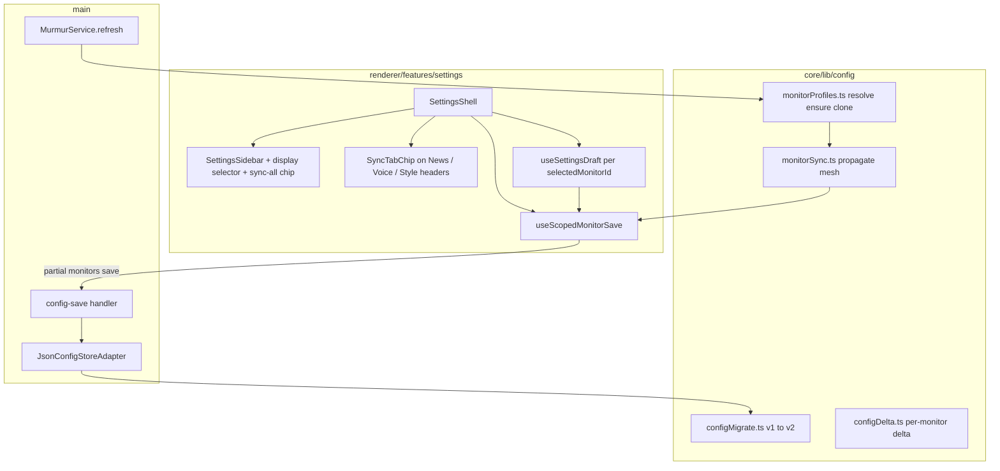

# Technical Spec: Per-monitor settings & tab sync

| Field | Value |
|-------|-------|
| Status | **Locked** (2026-08-02) |
| Author | Murmur engineering |
| Created | 2026-08-02 |
| Updated | 2026-08-02 |
| Product spec | [functional-spec.md](./functional-spec.md) |
| Related | [architecture](../../architecture.md), [settings-ui-reorg technical spec](../settings-ui-reorg/technical-spec.md) |

## Summary

Move News, Voice, and Style fields from flat `MurmurConfig` into **per-monitor profiles** on `monitors[]`, keep **global** connection/schedule/startup at the root, and implement **tab-scoped sync meshes** with persisted flags. Settings gains a **display selector** and **icon sync chips**; save path applies **mesh propagation** in `@core` before persistence. `MurmurService.refresh` uses **union RSS fetch** and **per-monitor generation/paint**. Config file bumps to **`configVersion: 2`** with a one-time migration from v1.

**Complexity:** High (schema migration, sync propagation, draft/scoped UI, service loop, wallpaper + config-save side effects, E2E). Single feature branch; no new services or npm deps.

**Infrastructure (v1, locked):**

| Area | Decision |
|------|----------|
| Runtime | Existing Electron app |
| Config persistence | `murmur.config.json` via `JsonConfigStoreAdapter` — **`configVersion: 2`**, nested profiles on `monitors[]` |
| UI persistence | `localStorage` key `murmur.settingsUi.v1` — add **`selectedMonitorId`** |
| Display list | `window.api.getScreens()` (+ merge with `config.monitors` ids); labels **Display 1…N** in stable sort order |
| Primary display | `screen.getPrimaryDisplay()` in main when cloning new monitor rows |
| Sync logic | Pure functions in `@core/lib/config/monitorProfiles.ts` + `@core/lib/config/monitorSync.ts` |
| IPC | **No new channels** — still `config:get` / `config:save` partial merge |
| Generation / refresh | `MurmurService` reads effective profile per screen; union feeds via `collectUnionFeedUrls(config, screens)` |
| Post-save effects | `classifyConfigDelta` extended to compare **all monitor profiles**; full `refresh()` when any content delta (v1 simplicity) |
| Feature flags | None |

## Engineering principles (applied)

| Principle | Application |
|-----------|-------------|
| Product spec is truth | Scoped tabs, chips, mesh rules, migration defaults |
| Hexagonal boundaries | Profile resolve + sync propagation in `@core/lib`; main/renderer call shared helpers |
| Fail closed | Zod validates each enabled monitor has ≥1 feed URL; custom tone rule per profile |
| Minimal IPC | Mesh expansion on save in renderer **or** main merge step before `configStore.set` |
| Backward compatibility | v1→v2 migration in `JsonConfigStoreAdapter.get()`; rewrite file once when migrated |
| E2E contract | New `tests/e2e/per-monitor-settings.spec.ts` + update helpers that assume global feeds |

## Architecture



### Module responsibilities

| Module | Responsibility |
|--------|----------------|
| `core/domain/config-types.ts` | `MonitorProfile`, expanded `MonitorConfig`, slim `MurmurConfig` root |
| `core/domain/config.schema.ts` | Zod for v2; `.superRefine` feeds + custom tone **per monitor** |
| `core/lib/config/configMigrate.ts` | `migrateConfigToV2(raw): MurmurConfig` |
| `core/lib/config/monitorProfiles.ts` | `getMonitorEntry`, `ensureMonitorsForScreens`, `cloneProfileFromPrimary`, `profileToPaintOptions`, field group constants |
| `core/lib/config/monitorSync.ts` | `propagateProfilePatch`, `setSyncFlag`, `meshMemberIds`, `TabScope` = `'news' \| 'voice' \| 'style'` |
| `core/lib/presets/configDelta.ts` | Compare global + all `monitors[].profile`; `pickDraftFields(profile)` |
| `JsonConfigStoreAdapter` | Run migration pre-parse; persist `configVersion: 2`; strip legacy top-level creative fields on write |
| `MurmurService` | Union fetch; filter items per monitor feeds; generate/paint per profile |
| `SettingsSidebar` | Display `<select>`, sync-all chip, pass `selectedMonitorId` |
| `SyncIconChip.tsx` | Toggle chip, link icon, `aria-label`, `title` tooltip |
| `useScopedMonitorSave.ts` | Wrap `saveConfig`: apply sync propagation, update `monitors` array |
| `DisplaysTab` | Drop duplicate monitor picker; use shell `selectedMonitorId`; single monitor card |

## Auth & authorization

Not applicable (local desktop).

## HTTP API

None.

## Realtime / IPC

| Channel | Change |
|---------|--------|
| `config:get` / `config:save` | Payload shape v2; partial save still shallow-merges root — **monitor saves must send full updated `monitors` array** (or merge helper in main — prefer renderer sends full array slice after pure transform) |
| `screens:get` | Unchanged — used for selector + `ensureMonitorsForScreens` |
| `action:previewTheme` | Use **selected monitor profile** paint fields + override theme argument |
| Others | Unchanged |

Preload / `window-api.d.ts`: types follow `MurmurConfig` v2.

## Data model

### Versioning

| Field | Type | Notes |
|-------|------|--------|
| `configVersion` | `1 \| 2` | Default `2` for new installs; absent file treated as v1 before migration |

### Global fields (root `MurmurConfig`)

| Field | Notes |
|-------|--------|
| `geminiApiKey` | Unchanged |
| `refreshIntervalMinutes` | Unchanged |
| `launchAtLogin` | Unchanged |
| `configVersion` | `2` |
| `monitors` | Array of `MonitorConfig` (expanded) |

**Removed from root after migration (do not persist in v2):** `feeds`, `language`, `theme`, `animation`, `overlays`, `headlineSampleSize`, `fontFamily`, `textAlignment`, `layoutStyle`, `vignetteStyle`, `audioFeedback`, `systemPrompt`, `enableBold`, `enableItalic`, `enableNewlines`, `enableDifferentFonts`, `noiseIntensity`, `tonePreset`, `customToneText`.

### `MonitorProfile`

Single object holding all creative fields previously at root (same defaults as today’s `getDefaultConfig()` creative slice):

```typescript
type MonitorProfile = {
  feeds: string[]
  language: string
  theme: ThemeName
  animation: AnimationName
  overlays: OverlayConfig
  headlineSampleSize: number
  fontFamily: MurmurConfig['fontFamily']
  textAlignment: 'center' | 'left' | 'right'
  layoutStyle: LayoutStyleName
  vignetteStyle: 'none' | 'soft' | 'medium' | 'dramatic'
  audioFeedback: boolean
  systemPrompt: string
  enableBold: boolean
  enableItalic: boolean
  enableNewlines: boolean
  enableDifferentFonts: boolean
  noiseIntensity: 'none' | 'subtle' | 'heavy'
  tonePreset: TonePreset
  customToneText: string
}
```

### `MonitorConfig`

```typescript
type MonitorConfig = {
  id: string
  enabled: boolean
  syncNews: boolean
  syncVoice: boolean
  syncStyle: boolean
  profile: MonitorProfile
}
```

- **`themeOverride` removed** — theme lives in `profile.theme`; Displays “preview theme” temporarily overrides paint only (unchanged UX) or sets `profile.theme` if product prefers (default: **preview paint only**, no persist).
- **Sync all tabs chip (UI derived):** selected when `syncNews && syncVoice && syncStyle`. Toggling on sets all three `true`; off sets all three `false` for **selected display only**.

### Tab → profile field mapping (for sync propagation)

| Tab scope | Keys updated together |
|-----------|------------------------|
| `news` | `feeds` |
| `voice` | `systemPrompt`, `tonePreset`, `customToneText`, `language`, `enableBold`, `enableItalic`, `enableNewlines`, `enableDifferentFonts`, `headlineSampleSize` |
| `style` | `theme`, `animation`, `overlays`, `fontFamily`, `textAlignment`, `layoutStyle`, `vignetteStyle`, `audioFeedback`, `noiseIntensity` |

Mood apply (`applyAestheticMood`) patches **style + voice** fields; propagation runs **twice** (style mesh + voice mesh) or one save with two scope patches — implementation detail: single save applying mood updates both scopes if respective sync flags on.

### Mesh propagation (pure)

```typescript
function propagateProfilePatch(
  config: MurmurConfig,
  sourceMonitorId: string,
  scope: TabScope,
  patch: Partial<MonitorProfile>
): MurmurConfig
```

Algorithm:

1. If source monitor’s sync flag for `scope` is **false**, apply `patch` only to source monitor’s `profile`.
2. If **true**, compute `members = { id | monitors[].syncFor(scope) }`.
3. For each member, merge `pickScopeFields(patch)` into `profile` (deep merge for `overlays` only within scope).

Sync flag changes (`setSyncFlags`) do **not** copy profile data (product: hint only on re-enable).

### Migration v1 → v2

In `JsonConfigStoreAdapter.get()` before Zod:

1. If `configVersion === 2`, parse with v2 schema.
2. Else build `legacyProfile` from top-level creative fields (defaults for missing).
3. For each entry in `monitors[]` (may be empty), set `profile = clone(legacyProfile)`, `syncNews/Voice/Style = true`, drop `themeOverride` by merging into `profile.theme` if set.
4. If `monitors` empty, leave empty until `ensureMonitorsForScreens` runs (on config get after parse **or** first refresh — **run in config get** when `screens:get` available is hard in adapter; run in **main bootstrap** after first `getScreens` + merge into config and persist).
5. Set `configVersion: 2`, write file if dirty.

**Wizard / first feed:** `SettingsShell` wizard saves `{ geminiApiKey, monitors: [primaryProfile with one feed] }`; `ensureMonitorsForScreens` clones primary to other connected displays.

### UI state (`localStorage`)

Extend `SettingsUiState`:

```typescript
type SettingsUiState = {
  activeTab: SettingsTab
  displaysSection: DisplaysSection
  scrollByTab: Partial<Record<SettingsTab, number>>
  selectedMonitorId?: string
}
```

- On load: if `selectedMonitorId` missing or not in current screen list, default to **first display** in sorted screen order.
- Persist on display selector change.

### Draft session (Style / Voice)

- Key draft by monitor: extend `settingsDraftSession` to `murmur.settingsDraft.v1:<monitorId>` **or** store `{ monitorId, fields }` in one session object.
- Switching display with dirty draft: **keep independent drafts per monitor** (no prompt v1); switching back restores that monitor’s draft from session.
- `pickDraftFields` operates on `MonitorProfile` subset; `applyDraft` calls `useScopedMonitorSave` with style/voice scopes as needed.

## Frontend

### `SettingsSidebar`

- Display selector (`SettingsSelect` or compact list) under branding.
- **Sync all tabs** `SyncIconChip` beside selector; disabled on **General** tab (hide or inert).
- Pass `selectedMonitorId`, `onMonitorChange`, sync state, `onSyncAllTabsChange` to shell.

### Scoped tabs

| Tab | Change |
|-----|--------|
| `GeneralTab` | Global only; subtitle “Applies to all displays” |
| `NewsSourcesTab` | Read/write `monitors[i].profile.feeds`; header `SyncIconChip` → `syncNews` |
| `VoiceTab` | Draft on selected monitor profile; chip → `syncVoice` |
| `StyleTab` | Draft on selected monitor profile; chip → `syncStyle` |
| `DisplaysTab` | Single card for `selectedMonitorId`; History uses same id; remove internal multi-select when sidebar selector present |

### `useScopedMonitorSave`

```typescript
async function saveMonitorProfileUpdate(
  monitorId: string,
  scope: TabScope | 'flags',
  updater: (prev: MonitorConfig) => MonitorConfig
)
```

Loads config, maps monitors, applies updater, runs `propagateProfilePatch` when scope is a tab and patch includes profile fields, then `api.saveConfig({ monitors })`.

Instant-save tabs (News) call this on each change. Draft Apply calls after merge to committed profile.

### Components

| Component | `data-testid` (E2E) |
|-----------|---------------------|
| Display selector | `settings-display-select` |
| Sync all chip | `settings-sync-all-tabs` |
| Tab sync chip | `settings-sync-tab-<news|voice|style>` |

## Wallpaper / runtime

### `WallpaperView`

- Resolve `const profile = getMonitorEntry(config, monitorId)?.profile ?? defaultProfile`.
- Use `profile.*` instead of root config for theme, animation, overlays, etc.

### `MurmurService.refresh`

1. `config = await configStore.get()` then `config = ensureMonitorsForScreens(config, screens, primaryId)` (persist if new rows).
2. `urls = collectUnionFeedUrls(config, screens)` — feeds from **enabled** monitors only.
3. `rssItems = await rss.fetchAll(urls)`.
4. For each screen:
   - Skip if disabled.
   - `profile = getProfile(config, screen.id)`.
   - `items = rssItems.filter(i => profile.feeds.includes(i.feedUrl))` (or match normalized URL).
   - If `items.length === 0`, warn + keep previous phrase (existing behavior).
   - `sampleHeadlines(items, profile.headlineSampleSize)`.
   - Generate with profile voice fields + `getLayoutContentSpec(profile.layoutStyle)`.
   - Paint with profile style fields (no `themeOverride`).

### `config-save` side effects

Replace flat `classifyConfigDelta(prev, next)` with:

```typescript
classifyGlobalConfigDelta(prev, next) // launch, interval, api key only
classifyAnyMonitorProfileDelta(prev, next) // content vs visual across all monitors
```

If **any** monitor has **content** delta → `murmurService.refresh(...)`. If **only visual** → `reRenderWallpapers`. (Same branching as today, broader compare.)

When sync propagates, a single user edit may update multiple monitors in one save → delta detection sees all changes → one refresh (acceptable v1).

## Security checklist

- [ ] No API key in per-monitor profiles (stays root only).
- [ ] RSS URLs still validated as URLs in Zod per monitor.
- [ ] No new `openExternal` surface.

## Deployment

Standard desktop build; migration runs locally on first launch after upgrade.

## Environment variables

Unchanged (`MURMUR_E2E`, etc.). E2E may stub two virtual displays only if harness supports; otherwise unit tests cover mesh + service, E2E single-display with sync flags toggling persistence.

## Testing

| Layer | Scope |
|-------|--------|
| Unit | `configMigrate.test.ts` — v1 file → v2, themeOverride merge, sync defaults true |
| Unit | `monitorSync.test.ts` — mesh propagation, solo off, partial membership |
| Unit | `monitorProfiles.test.ts` — union feeds, ensureMonitors clone primary |
| Unit | `configDelta.test.ts` — per-monitor content/visual detection |
| Unit | `MurmurService.test.ts` — two monitors, different feeds, union fetch mocked once |
| Integration | Optional config round-trip through schema |
| E2E | `per-monitor-settings.spec.ts` — selector visible, toggle news sync off, different feed lists persisted, voice sync propagation (two ids if CI has one display: use save + getConfig IPC from evaluate to assert two monitor entries seeded in test config) |

**E2E note:** With one physical display, seed `monitors` with two synthetic ids in test setup via config fixture helper (if exists) or main E2E config stub — follow existing `MURMUR_E2E` patterns in `bootstrap/e2e-overrides`.

## Implementation phases

| Phase | Deliverable |
|-------|-------------|
| **1 — Core model** | Types, Zod v2, `configMigrate`, `monitorProfiles`, unit tests |
| **2 — Sync + save** | `monitorSync`, `useScopedMonitorSave`, update `configDelta` |
| **3 — Service** | `MurmurService` + `previewTheme` + `updateClockWallpapers` use profiles; union RSS |
| **4 — Migration path** | `JsonConfigStoreAdapter` + bootstrap `ensureMonitorsForScreens` persist |
| **5 — Settings UI** | Sidebar selector, chips, scoped tabs, Displays simplification, UI state |
| **6 — Wallpaper** | `WallpaperView` profile resolve |
| **7 — Verification** | E2E spec, fix broken tests, full suite before loop-build COMPLETE |

Suggested branch: `feature/per-monitor-settings`.

## Acceptance mapping

Maps to [functional-spec acceptance criteria](./functional-spec.md#acceptance-criteria):

| AC | Technical coverage |
|----|---------------------|
| 1 | Sidebar `settings-display-select`; General global-only; tabs read `monitors[selected].profile` |
| 2 | `SettingsUiState.activeTab` unchanged on `selectedMonitorId` change |
| 3 | `collectUnionFeedUrls` + per-monitor feed filter in `MurmurService`; E2E/unit |
| 4–5 | `monitorSync.test.ts` + voice/style propagation integration |
| 6–8 | `SyncIconChip` + `setSyncFlags` persistence; a11y labels |
| 7 | Sync-all sets three booleans on selected monitor only |
| 9 | `ensureMonitorsForScreens` + `cloneProfileFromPrimary` |
| 10 | `configMigrate` + default sync flags true |
| 11 | `DisplaysTab` history keyed to `selectedMonitorId` |
| 12 | E2E file + unit suite listed above |

## Out of scope (technical)

- Field-level sync subsets within a tab.
- Orphan profile GC for stale monitor ids.
- Partial refresh (only changed monitors) — v1 full refresh on content delta.
- New IPC for `saveMonitorProfile` — use existing save with propagated `monitors`.

## Open items (minor)

| Item | Default |
|------|---------|
| Empty `monitors` before first refresh | Bootstrap ensures rows when Settings opens via `getScreens` + persist |
| Mood preset on Voice tab | Propagate voice + style scopes according to respective sync flags |
| `isAestheticMoodActive` | Compare against **selected monitor profile**, not root |
