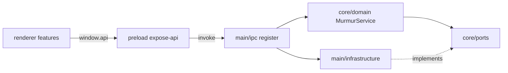

# Technical Spec: Murmur repository restructure (all-desktop)

| Field | Value |
|-------|-------|
| Status | **Locked** (aligned with functional spec 2026-08-02) |
| Author | Murmur engineering |
| Created | 2026-08-02 |
| Updated | 2026-08-02 (expanded scope) |
| Product spec | [functional-spec.md](./functional-spec.md) |
| Related | [architecture.md](../../architecture.md), [electron-vite dev guide](https://electron-vite.org/guide/dev) |

## Summary

Execute a phased move from the current flat `src/{domain,ports,adapters,shared,main,preload,renderer}` layout to **`src/core` + `src/main/*` + feature-based renderer**, preserving electron-vite entry points (`src/main/index.ts`, `src/preload/index.ts`, `src/renderer/index.html`). Update path aliases, ESLint boundaries, tests imports, and architecture documentation. **No** change to IPC semantics, `userData` files, or product features.

**Complexity:** High (structure + granularity + test re-layout + full architecture rewrite). One engineer, **~12 phased steps** with test gate after each.

**Infrastructure (v1, locked):**

| Area | Decision |
|------|----------|
| Runtime | Single Electron app; **no new processes or services** |
| Build | **electron-vite** unchanged as bundler; entry paths preserved |
| Package manager | **npm** (existing); no workspace migration |
| DI | Manual **`buildAppContext()`** in `main/bootstrap/composition-root.ts` |
| IPC | Existing **`ipcMain.handle` / `ipcRenderer.invoke`** + events |
| Lint | **ESLint** with `no-restricted-imports` for **renderer + preload** → main/infrastructure; root **`npm run lint`** (AC-12) |
| Remote API | None |

## Engineering principles (applied)

| Principle | Application |
|-----------|-------------|
| electron-vite defaults | Keep official main/preload/renderer roots ([electron-vite dev](https://electron-vite.org/guide/dev)) |
| Hexagonal / hybrid | `core/domain` + `core/ports` + `core/lib`; IO in `main/infrastructure` |
| Electron security | Narrow preload; renderer never imports Node/Electron adapters ([Electron preload tutorial](https://www.electronjs.org/docs/latest/tutorial/tutorial-preload)) |
| Composition root | Single bootstrap module wires ports → `MurmurService` + `Scheduler` |
| Minimal diff per phase | Move + import fix; avoid drive-by refactors |
| Tests arbitrate | Run unit → integration → build → E2E per phase where touched |

## Architecture

### Target directory tree (production)

```text
src/
├── core/
│   ├── domain/
│   │   ├── MurmurService.ts, Scheduler.ts, HeadlineSampler.ts, config.schema.ts
│   │   ├── config-types.ts      # MurmurConfig, MurmurState, layout enums, …
│   │   └── prompts.ts           # DEFAULT_SYSTEM_PROMPT, mood prompts, …
│   ├── ports/                   # I* except deleted IWallpaperBackup
│   └── lib/
│       ├── layout/              # layoutContentSpecs, layoutSpecToZod, layoutContentParse, …
│       ├── phrase/              # phrasePlainText, phraseFormatFlags, phraseLayoutSplit, …
│       ├── presets/             # promptPresets, clickbaitPreset, exampleFeeds
│       └── generation/          # StructuredPhrasePromptBuilder, geminiFormattingRules, …
├── main/
│   ├── index.ts
│   ├── configureAppBranding.ts
│   ├── lib/                     # resolveBrandIcon.ts
│   ├── e2e/                     # e2eStructuredPhraseStub.ts (main-only; MURMUR_E2E)
│   ├── bootstrap/
│   ├── ipc/
│   ├── windows/
│   └── infrastructure/
├── shared/
│   └── ipc-contract.ts
├── preload/
└── renderer/
    ├── main.tsx, index.html, index.css, public/
    ├── types/window-api.d.ts
    ├── components/              # shared dumb UI across features
    ├── app/AppShell.tsx
    └── features/
        ├── settings/
        │   ├── SettingsShell.tsx
        │   ├── tabs/            # appearance, history, feeds, …
        │   ├── hooks/
        │   └── components/
        ├── wallpaper/
        └── moods/
```

### Target test tree (mirrors `src/`)

```text
tests/
├── unit/
│   ├── core/
│   │   ├── domain/              # MurmurService, Scheduler, HeadlineSampler, …
│   │   └── lib/                 # layoutContent, phrase*, geminiFormattingRules, …
│   └── main/
│       └── infrastructure/      # *Adapter.test.ts paths mirror infra folders
├── integration/
│   └── core/                    # pipeline.test.ts (MurmurService + mocks)
└── e2e/                         # unchanged role; helpers/ fixtures/ at this level
```

**Rule:** `tests/unit/X/Y/Z.test.ts` corresponds to `src/X/Y/Z.ts` (or folder index). **`tests/unit/placeholder.test.ts` is deleted.** Update `vitest.config.ts` `include` to `tests/unit/**/*.test.ts` (recursive).

### Wallpaper backup / restore (product behavior — unchanged)

The feature **works today** and must remain after restructure:

| Piece | Role |
|-------|------|
| **`IWallpaperRenderer`** | Port defines `backup()` and `restore()` alongside `set()` / `getScreens()`. |
| **`MacDesktopWallpaperAdapter` / `WinDesktopWallpaperAdapter`** | Implement backup/restore (`userData/wallpaper_backup.json`, copies under `wallpaper_backup/` on Mac; `WallpaperHelper.exe` on Win). |
| **`main/index.ts` (→ lifecycle module)** | Calls `wallpaperRenderer.backup()` after init; **`restore()` on real quit** (skips dev hot-reload per `userRequestedWallpaperRestore`). |

**`IWallpaperBackup.ts` is dead code** — identical shape but **never imported**; scaffolding docs refer to it historically. **Delete** during Phase 2 or 8; document only **`IWallpaperRenderer`** in architecture.md (AC-18).

```text
app ready → wallpaperRenderer.backup()
user quit   → wallpaperRenderer.restore()  (unless dev relaunch rule)
```

### Call flow (unchanged semantics)



### Module mapping (current → target)

| Current path | Target path |
|--------------|-------------|
| `src/domain/**` | `src/core/domain/**` |
| `src/ports/**` | `src/core/ports/**` |
| `src/shared/**` | `src/core/lib/**` except `ipc-contract` → `src/shared/ipc-contract.ts` |
| `src/shared/resolveBrandIcon.ts` | `src/main/lib/resolveBrandIcon.ts` |
| `src/adapters/**` | `src/main/infrastructure/**` |
| `src/main/index.ts` (wiring chunks) | `bootstrap/`, `ipc/`, `windows/` |
| `src/renderer/App.tsx` | Split → `app/AppShell.tsx` + `features/settings/**` |
| `src/renderer/WallpaperView.tsx` | `features/wallpaper/WallpaperView.tsx` |
| `src/renderer/components/MoodsTab.tsx` | `features/moods/**` |
| `src/shared/e2eStructuredPhraseStub.ts` | `src/main/e2e/e2eStructuredPhraseStub.ts` |
| `src/domain/types.ts` | Split → `core/domain/config-types.ts` + `core/domain/prompts.ts` (+ re-export barrel optional) |
| `src/ports/IWallpaperBackup.ts` | **Delete** (see wallpaper section) |
| `tests/unit/*.test.ts` | `tests/unit/core/**` or `tests/unit/main/infrastructure/**` per mirror rule |
| `tests/integration/pipeline.test.ts` | `tests/integration/core/pipeline.test.ts` |

### Path aliases (locked)

Update `electron.vite.config.mts` and `tsconfig.json` (and vitest if path-aware):

| Alias | Resolves to | Main | Preload | Renderer |
|-------|-------------|------|---------|----------|
| `@core/domain` | `src/core/domain` | yes | types only | yes |
| `@core/ports` | `src/core/ports` | yes | no | no |
| `@core/lib` | `src/core/lib` | yes | limited | yes |
| `@main` | `src/main` | yes | no | **no** |
| `@shared/ipc` | `src/shared/ipc-contract` | yes | yes | yes |

Remove renderer/preload aliases for `@adapters`, `@ports` (direct), or legacy `@domain` unless redirected to `@core/*`.

**Rule:** Renderer and preload may import `@core/domain` (types), `@core/lib` (pure helpers used in UI), and `@shared/ipc-contract`. They must not import `@core/ports`, `@main/**`, or any file under `main/infrastructure` or `main/bootstrap`.

### `core/lib` purity (locked)

After Phase 1, every file under `src/core/lib/**` must have **no** imports from `electron`, Node `fs`/`path` (except types-only if ever needed), `canvas`, or `main/infrastructure`. Run a one-time audit during Phase 1; **`resolveBrandIcon.ts` is explicitly main-only** (`main/lib/`).

### IPC contract location (best practice)

Keep **`src/shared/ipc-contract.ts`** as the only module under `src/shared/`:

- **Domain types** (`MurmurConfig`, `MurmurState`) stay in **`core/domain`** — preload/renderer import those for typing.
- **Channel strings** (`config:get`, …) stay in **`ipc-contract`** so preload and main share one source of truth without pulling domain services or infrastructure.
- Do **not** put channel constants in `core/lib` (mixes transport with business helpers) or duplicate strings in preload/main.

This matches common Electron + electron-vite patterns (`src/shared/ipc.ts` in community starters).

### IPC contract (locked channel list)

Define in `src/shared/ipc-contract.ts`:

| Channel | Direction | Purpose |
|---------|-----------|---------|
| `config:get` | invoke | Load config |
| `config:save` | invoke | Save partial config |
| `config:updated` | event → renderer | Push config after save |
| `history:get` | invoke | Monitor history strings |
| `history:clear` | invoke | Clear monitor history |
| `action:refresh` | invoke | Trigger MurmurService refresh |
| `action:previewTheme` | invoke | Theme preview on monitor |
| `state:get` | invoke | Current `MurmurState` |
| `state:updated` | event → renderer | Push state |

Preload continues to expose `window.api` with the same method names as today (`src/preload/index.ts`).

### IPC handler orchestration (unchanged behavior)

Not every handler delegates only to `MurmurService`. In particular, **`config:save`** must retain today’s main-process orchestration: config persist, **launch-at-login** via startup adapter, **scheduler** start/stop on interval/API key changes, **background wallpaper window** lifecycle when animation mode changes, **`shouldRegeneratePhraseAfterConfigSave`** vs re-render-only paths, and **`config:updated` / `state:updated`** broadcasts. Extract to `main/ipc/handlers/config-save.ts` (or equivalent), not slimmed down to a single service call.

### Bootstrap / composition root

Export a typed context from `composition-root.ts`, e.g.:

```typescript
export type AppContext = {
  configStore: IConfigStore
  historyStore: IHistoryStore
  murmurService: MurmurService
  scheduler: Scheduler
  trayAdapter: ISystemTray
  startupAdapter: IStartupIntegration
  // wallpaper/rss/phrase/wallpaperRenderer refs as needed for IPC + windows
}
```

- **`buildAppContext()`** — platform-specific wallpaper renderer selection, real adapters.
- **`buildE2eAppContext()`** — delegates to `e2e-overrides.ts` when `MURMUR_E2E` (same behavior as current `main/index.ts` stubs).

`main/index.ts` holds module-level window state (`settingsWindow`, `bgWindows`, `state` mirror if still needed for IPC) or moves window maps into `windows/` modules with callbacks into service.

### `core/lib` file → subfolder map (Phase 8)

| Former `shared/` file | Target |
|----------------------|--------|
| `layoutContentSpecs`, `layoutSpecToZod`, `layoutContentParse`, `layoutContentPreview` | `core/lib/layout/` |
| `phrasePlainText`, `phraseFormatFlags`, `phraseLayoutSplit`, `phraseSyntaxValidation`, `payloadToPlainSummary` | `core/lib/phrase/` |
| `promptPresets`, `clickbaitPreset`, `exampleFeeds`, `appearanceRegenerate` | `core/lib/presets/` |
| `StructuredPhrasePromptBuilder`, `geminiFormattingRules` | `core/lib/generation/` |

### Settings feature split (Phase 9)

Break `App.tsx` into at least:

| Module | Responsibility |
|--------|----------------|
| `features/settings/SettingsShell.tsx` | Layout, sidebar, tab routing |
| `features/settings/tabs/AppearanceTab.tsx` | Appearance selects, layout, animation |
| `features/settings/tabs/HistoryTab.tsx` | Phrase history preview/raw JSON |
| `features/settings/tabs/FeedsTab.tsx` (or combined) | RSS / API key / wizard steps as today |
| `features/settings/hooks/useMurmurConfig.ts` | load/save via `window.api` |
| `features/moods/*` | Moods tab + `handleMoodChange` (from App) |

Exact tab names may follow current sidebar; **no file over ~400 lines** in `features/settings/`.

## Auth & authorization

Not applicable (local desktop app). IPC trust model unchanged: renderer is untrusted; main validates config saves via existing schema/adapters.

## HTTP API

None.

## Realtime

Existing Electron IPC events only (`state:updated`, `config:updated`).

## Data model

No change. Still `murmur.config.json`, `murmur.history.json` via `JsonConfigStoreAdapter` / `JsonHistoryStoreAdapter` under infrastructure.

## Frontend (renderer)

- Feature folders as above; **no new routes** beyond query `view=wallpaper`.
- Global types for `window.api`: update path to preload `index.d.ts` if present or add `renderer/types/window-api.d.ts`.
Keep **`renderer/main.tsx`** as bootstrap only (React root, CSS import). Preserve all **`data-testid`** values used in E2E specs when moving files.

### `docs/architecture.md` rewrite checklist (Phase 11 — AC-10)

Replace/expand into a **maintainer playbook**, not only a layer table:

1. **Product shape** (tray, wallpaper paths, structured phrases) — keep accurate.
2. **Full trees** — `src/` production tree + `tests/` mirror + root `resources/`, `scripts/`.
3. **Process model** — main / preload / renderer; what each may import; ESLint rules; aliases table.
4. **Call flows** — renderer → preload → IPC → service → ports → infrastructure (incl. `config:save` orchestration).
5. **Wallpaper backup/restore** — `IWallpaperRenderer`, adapters, files under `userData`, dev vs quit behavior.
6. **Packaged assets** — `resources/` (icons, fonts, `bin/WallpaperHelper.exe`) vs `renderer/public/logo.png` for dev UI.
7. **Adding a feature** — numbered checklist (port → adapter → bootstrap → IPC contract → preload API → renderer feature → canvas+CSS parity → unit + E2E).
8. **Testing** — commands, E2E stub env vars, screenshot paths, mirrored unit layout.
9. **Related docs** — link `docs/features/*`, note **`docs/scaffolding/` superseded**.
10. **Explicit non-goals** — no bundled API; where cloud would plug in later.

Add a short **superseded** notice at the top of `docs/scaffolding/functional_spec.md` and `technical_spec.md` pointing to feature specs.

## Security checklist

- [ ] Renderer **and preload** ESLint blocks `main/infrastructure`, `main/bootstrap`, `@main/**`
- [ ] Preload does not expose `ipcRenderer` wholesale ([Electron guidance](https://www.electronjs.org/docs/latest/tutorial/tutorial-preload))
- [ ] Vite renderer config does not alias infrastructure into bundle
- [ ] No secrets added to repo during moves

## Deployment

Same as today: `npm run build`, `electron-builder` `dist/` / installer. No new env vars required for restructure.

## Environment variables

Unchanged for product behavior. E2E variables (`MURMUR_E2E`, fixture paths, etc.) remain honored from `bootstrap/e2e-overrides.ts`.

## Testing

| Layer | Scope |
|-------|--------|
| Unit | `tests/unit/**` mirrors `src/**` (see target test tree) |
| Integration | `tests/integration/core/pipeline.test.ts` |
| E2E | `tests/e2e/**` — no spec changes unless selectors break; run full suite before COMPLETE |
| Lint | Add ESLint + **`npm run lint`** in `package.json`; scope `src/renderer/**` and `src/preload/**` |

**Gate before complete:** `npm run lint && npm run test:unit && npm run test:integration && npm run build && env -u ELECTRON_RUN_AS_NODE npm run test:e2e` (per [architecture.md](../../architecture.md)).

## Implementation phases

| Phase | Deliverable | Test gate |
|-------|-------------|-----------|
| **0** | Add ESLint + `no-restricted-imports` (renderer + preload); **`npm run lint`**; add `ipc-contract.ts` | lint config + script run |
| **1** | Create `src/core/**`; move `domain`, `ports`, `shared` → `core/lib` (audit purity; **`resolveBrandIcon` → main/lib**); fix imports; aliases in main, **preload**, renderer, vitest | unit + integration |
| **2** | Move `adapters` → `main/infrastructure`; fix imports | unit + integration |
| **3** | Extract `bootstrap/composition-root.ts` + `e2e-overrides.ts` from `main/index.ts` | unit + integration + dev smoke |
| **4** | Extract `ipc/register-ipc.ts` + `windows/*`; slim `main/index.ts` | unit + integration + E2E subset (murmur.spec) |
| **5** | Refactor renderer into `features/*` + `AppShell` + `renderer/components` | build + E2E subset |
| **6** | Tighten Vite/tsconfig aliases; **verify AC-5** | full lint + E2E |
| **7** | **Phase 8:** `core/lib` subfolders + domain type split (`config-types.ts`, `prompts.ts`) | unit + integration |
| **8** | **Phase 9:** Settings granularity (tabs/hooks); enforce ~400-line limit | build + E2E settings flows |
| **9** | **Phase 10:** Mirror all unit tests; move integration; delete `placeholder.test.ts`; remove **`IWallpaperBackup.ts`** | full unit + integration |
| **10** | **`main/e2e/`** stub move; **`window-api.d.ts`** | E2E groups |
| **11** | **Rewrite** [architecture.md](../../architecture.md) + scaffolding superseded notices | doc review |
| **12** | Final gate | lint + all tests + build + dev smoke |

Phases 7–11 may merge but **granularity (8–9) and test mirror (10) must complete before architecture rewrite (11)**.

**AC-5 (aliases) is verified after Phase 6.** Mid-migration branches may still expose legacy aliases until then.

## Acceptance mapping

| Functional AC | Technical deliverable |
|---------------|------------------------|
| AC-1 layout | Target tree in place; old empty dirs removed; `shared/` only ipc-contract |
| AC-2 composition | `composition-root.ts` + slim `index.ts` |
| AC-3 IPC parity | `ipc-contract.ts` + preload parity table verified |
| AC-4 lint | ESLint restricted imports on `src/renderer/**` and `src/preload/**` |
| AC-5 aliases | Verified post–Phase 6: `electron.vite.config.mts` + `tsconfig.json` per alias table |
| AC-6 unit | `npm run test:unit` green |
| AC-7 integration | `npm run test:integration` green |
| AC-8 E2E | `npm run test:e2e` green |
| AC-9 build | `npm run build` + dev launch |
| AC-10 architecture rewrite | Phase 11 checklist + scaffolding superseded headers |
| AC-11 data | No new paths in adapters except file moves |
| AC-12 lint script | `npm run lint` in package.json passes |
| AC-13 core/lib subfolders | `core/lib/{layout,phrase,presets,generation}/` |
| AC-14 domain split | `config-types.ts` + `prompts.ts` |
| AC-15 settings granularity | No settings file over ~400 lines; `renderer/components/` |
| AC-16 test mirror | All unit tests under mirrored paths; no placeholder |
| AC-17 window.api types | `renderer/types/window-api.d.ts` |
| AC-18 wallpaper port | Delete `IWallpaperBackup`; doc `IWallpaperRenderer` backup/restore |
| AC-19 E2E stubs | `src/main/e2e/*` |

## Out of scope (technical)

- Monorepo, Turbo, pnpm.
- Rust/Node API crate.
- Rewriting Gemini or structured phrase pipelines.
- Playwright helper path changes unless imports break.

## Open items (minor)

| Item | Notes |
|------|--------|
| ESLint package | Add `eslint` + typescript-eslint; **`npm run lint`** documented in README |
| Vitest paths | Mirror tsconfig paths in `vitest.config.ts` in **Phase 1** (preload aliases in electron-vite too) |
| `WallpaperHelper.cs` | Stays with Win wallpaper adapter under `main/infrastructure/wallpaper/` |

## Follow-up

Implementation: [loop-build](../../../.agents/skills/loop-build/SKILL.md) with `docs/features/repo-restructure/loop-state.md` when execution starts.
