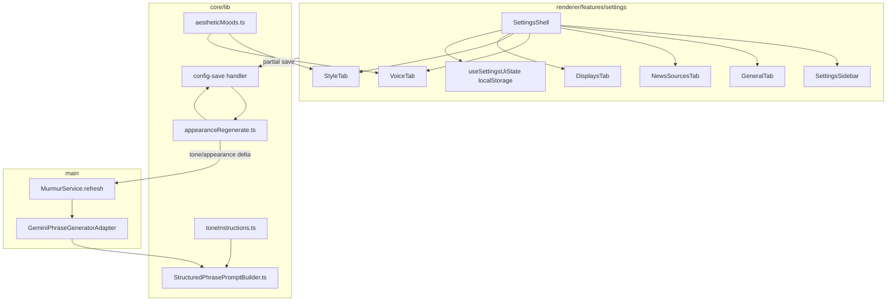

# Technical Spec: Settings UI information architecture reorganization

| Field | Value |
|-------|-------|
| Status | **Locked** (2026-08-02) |
| Author | Murmur engineering |
| Created | 2026-08-02 |
| Updated | 2026-08-02 |
| Product spec | [functional-spec.md](./functional-spec.md) |
| Related | [architecture](../../architecture.md), [repo-restructure technical spec](../repo-restructure/technical-spec.md) |

## Summary

Refactor the Settings renderer into **five task-based tabs** (General, News sources, Voice & prompts, Style, Displays), merge mood gallery into **Style**, merge monitors + history into **Displays**, and add **Tone** as persisted config fields applied at Gemini call time (not in the system prompt textarea). Introduce a small **core preset module** for aesthetic moods (single source for Style cards and Voice mood-linked presets), extend **phrase regeneration** rules for tone changes, and persist **UI-only state** (tab, Displays sub-section, scroll) in `localStorage`. One additive IPC helper opens RSS URLs externally.

**Complexity:** Medium (renderer-heavy + config schema + generation path + broad E2E selector updates). Single branch `feature/settings-ui-reorg`, no new services.

**Infrastructure (v1, locked):**

| Area | Decision |
|------|----------|
| Runtime | Existing Electron app |
| Config persistence | `murmur.config.json` via `JsonConfigStoreAdapter` — **add** `tonePreset`, `customToneText` |
| UI persistence | **`localStorage`** key `murmur.settingsUi.v1` (not in config file) |
| Generation | Tone appended in **`buildStructuredPhrasePrompt`** (or caller) before layout/formatting tail |
| IPC | Existing `config:get` / `config:save`; **add** `shell:open-external` (URL string) |
| Feature flags | None |
| New npm deps | None (sidebar icons: inline SVG) |

## Engineering principles (applied)

| Principle | Application |
|-----------|-------------|
| Functional spec is product truth | Tab labels, tone behavior, and AC drive file layout and tests |
| Hexagonal boundaries | Tone resolution + mood apply live in `@core/lib`; renderer never imports `@main` |
| Single mood source | `applyAestheticMood()` used by Style gallery and mood-linked prompt presets |
| Fail closed on invalid config | Zod rejects `tonePreset: 'custom'` with empty `customToneText`; renderer validates before invoke |
| Minimal IPC churn | No new config channels; optional `openExternal` only |
| E2E as contract | Update all specs that click **Appearance** / **Ingestion & Feeds** / **Monitors** / **Phrase History** |

## Architecture



### Module responsibilities

| Module | Responsibility |
|--------|----------------|
| `core/lib/presets/aestheticMoods.ts` | Mood ids, `applyAestheticMood(id)`, `isAestheticMoodActive(config)`, `defaultToneForMood(id)` (v1 all `'none'`) |
| `core/lib/generation/toneInstructions.ts` | `TonePreset` enum, `resolveToneInstruction(config): string \| null` |
| `core/lib/generation/buildEffectiveSystemPrompt.ts` | `systemPrompt + tone block` for generation (pure) |
| `core/lib/presets/appearanceRegenerate.ts` | Add tone field comparisons to regeneration predicate |
| `core/domain/config.schema.ts` | `tonePreset`, `customToneText` + `.superRefine` for Custom |
| `renderer/.../useSettingsUiState.ts` | Read/write tab, `displaysSection`, scroll positions |
| `renderer/.../tabs/*` | One file per top-level tab; Style/Displays may use colocated section components |
| `main/ipc/handlers/open-external.ts` | `shell.openExternal(url)` with URL validation |
| `shared/ipc-contract.ts` | `shellOpenExternal: 'shell:open-external'` |

## Auth & authorization

Not applicable (local desktop). `openExternal` must validate `http:` / `https:` only before calling `shell.openExternal`.

## HTTP API

None.

## Realtime / IPC

| Channel | Change |
|---------|--------|
| `config:save` | Accepts partial config including `tonePreset`, `customToneText`; merge + schema parse unchanged |
| `config:get` | Returns full config including new fields |
| `shell:open-external` | **New** — `(url: string) => Promise<void>` |
| `state:updated`, `config:updated` | Unchanged |

Preload: expose `openExternal(url: string)` on `window.api`; update `window-api.d.ts`.

## Data model

### `MurmurConfig` additions

| Field | Type | Default | Notes |
|-------|------|---------|--------|
| `tonePreset` | `'none' \| 'neutral' \| 'professional' \| 'villero' \| 'custom'` | `'none'` | Stored in JSON |
| `customToneText` | `string` | `''` | Required non-empty when `tonePreset === 'custom'` |

Zod (conceptual):

```typescript
// config.schema.ts — refine when tonePreset === 'custom' → customToneText.trim().length > 0
```

`JsonConfigStoreAdapter.getDefaultConfig()` and parse path inherit defaults via schema.

### UI state (`localStorage` — not in `MurmurConfig`)

Key: **`murmur.settingsUi.v1`**

```typescript
type SettingsUiState = {
  activeTab: SettingsTab
  displaysSection: 'monitors' | 'history'
  scrollByTab: Partial<Record<SettingsTab, number>>
}
```

- Updated on tab change, Displays segment change, and debounced scroll (≥200ms) on `<main>` scroll container.
- Restored on `SettingsShell` mount after config load.
- Invalid/missing JSON → defaults: `activeTab: 'general'`, `displaysSection: 'monitors'`, empty scroll map.
- **Wizard exception:** first entry after wizard forces `activeTab: 'general'` once (session flag `murmur.wizardJustCompleted` in `sessionStorage`), then normal persistence resumes.

### Settings tab type

Replace `SettingsTab` union:

```typescript
export type SettingsTab =
  | 'general'
  | 'news'
  | 'voice'
  | 'style'
  | 'displays'
```

Remove `'feeds' | 'appearance' | 'monitors' | 'history' | 'moods'`.

## Generation: tone assembly

**Order** passed into Gemini user prompt construction:

1. `config.systemPrompt` (visible in UI; unchanged storage)
2. **Tone block** — if `resolveToneInstruction(config)` returns non-null, append:

   ```text

   Tone and delivery (follow strictly):
   <instruction text>
   ```

3. Existing `buildPhraseFormattingRules(formatFlags)`
4. Layout/headlines tail (unchanged)

Implementation: extend `buildStructuredPhrasePrompt(..., toneInstruction: string | null)` **or** call `buildEffectiveSystemPrompt(config)` in `MurmurService` / adapter before `buildStructuredPhrasePrompt`. Prefer **single helper** in `core/lib/generation/buildEffectiveSystemPrompt.ts` used by `MurmurService.generateStructured` call site and unit-tested.

### Built-in tone copy (v1)

Store strings in `toneInstructions.ts` (English, fixed):

| `tonePreset` | Instruction intent |
|--------------|-------------------|
| `none` | `null` (omit block) |
| `neutral` | Impartial, no sensationalism |
| `professional` | Formal newsroom / professional register |
| `villero` | Argentine street / vulgar register (label **Villero** in UI) |
| `custom` | `config.customToneText.trim()` |

## Regeneration & toasts

### Main process (`config-save.ts`)

Extend `shouldRegeneratePhraseAfterAppearanceChange` (and thus `shouldRegeneratePhraseAfterConfigSave`) with:

```typescript
prev.tonePreset !== next.tonePreset ||
prev.customToneText !== next.customToneText
```

Do **not** add `language` to regeneration predicate in v1 (language continues to apply on next full refresh unless product later expands scope).

When predicate true and API key present → existing `murmurService.refresh(...)` path runs (same as formatting toggles).

### Renderer toasts (`useMurmurConfig`)

| Save payload | Success toast |
|--------------|---------------|
| Default | `Settings saved successfully` (today) |
| Only `tonePreset` / `customToneText` changed | `Phrase updated with new tone` (or equivalent single line per functional AC) |
| Wizard submit | Existing save toast **plus** `Pick a look in Style when you’re ready` (second toast or combined message — prefer **one toast** with two sentences) |

Detect tone-only saves by comparing keys on `Partial<MurmurConfig>` before invoke.

**Custom tone validation:** if `tonePreset === 'custom'` and text empty → **do not** call IPC; `showToast(..., 'error')` with validation message.

## Frontend (renderer)

### File layout (target)

```text
src/renderer/features/settings/
├── SettingsShell.tsx          # tab routing, ui state, wizard gate
├── types.ts                   # SettingsTab, ToastState, DisplaysSection
├── components/
│   ├── SettingsSidebar.tsx    # 5 tabs + icons + Refresh footer
│   ├── SetupWizard.tsx
│   ├── SegmentedControl.tsx   # Displays sub-nav (optional dumb)
│   └── TabPageHeader.tsx      # H2 + subtitle
├── tabs/
│   ├── GeneralTab.tsx
│   ├── NewsSourcesTab.tsx
│   ├── VoiceTab.tsx
│   ├── StyleTab.tsx           # mood gallery + customize cards
│   └── DisplaysTab.tsx        # segment + shared monitor id + sections
├── hooks/
│   ├── useMurmurConfig.ts     # tone toast + validation hook-in
│   ├── useSettingsUiState.ts
│   ├── useSystemPromptDraft.ts
│   └── useMoodChange.ts       # thin wrapper → applyAestheticMood + saveConfig
└── lib/
    └── feedDisplayLabel.ts    # hostname from URL

src/core/lib/presets/aestheticMoods.ts   # moved logic from MoodsTab + useMoodChange
```

**Delete / stop routing:** `FeedsTab.tsx`, `AppearanceTab.tsx`, `MonitorsTab.tsx`, `HistoryTab.tsx` as top-level routes; **`features/moods/MoodsTab.tsx`** content absorbed into `StyleTab` (file may remain re-export or delete if unused).

### Width classes

| Tabs | Main content class |
|------|-------------------|
| General, News, Voice | `max-w-2xl` |
| Style, Displays | `max-w-4xl` (mood grid / monitor card) |

Apply via tab root wrapper or `SettingsShell` child wrapper.

### Style tab

- **Mood gallery:** 2-column grid `md:grid-cols-2`; card `onClick` activates mood (role=`button`, `tabIndex={0}`, Enter/Space); preserve `data-testid={`mood-card-${...}`}`.
- Remove amber manual banner; active state via border/badge on card only.
- **Customize:** four stacked cards (Look, Type & layout, Motion, Overlays) — split from current `AppearanceTab` JSX.
- Layout select: one-line helper + `<details>` or disclosure “About magazine layouts” for long copy.

### Voice tab

- **Prompt & presets:** single card — preset `<select>`, Apply, textarea.
- **Tone & language:** tone `<select>`, conditional custom text input, language `<select>`.
- **Markup:** 2×2 grid + section note.
- **Advanced:** `<details>` accordion closed by default — `headlineSampleSize` number input (min 5 max 50).

### News sources

- Add feed form first; list second.
- Row: `feedDisplayLabel(url)` primary, truncated URL secondary, Remove, icon button → `window.api.openExternal(url)`.

### Displays

- Segmented control under header.
- Shared `selectedMonitorId` state in `DisplaysTab` (initialized from `state.lastPhrases` keys like today).
- Hide selector when `Object.keys(lastPhrases).length <= 1`.
- **Monitors:** render one card for `selectedMonitorId`.
- **History:** reuse history fetch effect from `SettingsShell` (move into `DisplaysTab` or `useDisplayHistory` hook); Clear top-right.

### Sidebar

- Labels: General, News sources, Voice & prompts, Style, Displays.
- Subtitle: OS-neutral (e.g. “Desktop wallpaper app”).
- Inline SVG icons per tab (heroicons-style, 16–20px, no new package).

### App shell scroll persistence

Attach `ref` + `onScroll` to scrollable `<main>` in `AppShell.tsx` (or wrapper in `SettingsShell`) to persist `scrollByTab[activeTab]`.

## Mood-linked presets (Voice)

`useSystemPromptDraft.handlePresetChange` / `promptPresets`:

- When preset id is mood-linked → call `applyAestheticMood(moodId)` partial (includes `systemPrompt`, visual fields, **`tonePreset: defaultToneForMood(id)`**), `syncDraftFromPrompt`, `saveConfig` — same outcome as Style card click.
- Toast: default save toast only (functional: no confirm dialog).

## Security checklist

- [ ] `shell:open-external` rejects non-http(s) URLs
- [ ] Custom tone text not logged to console in production paths
- [ ] Renderer still ESLint-clean vs `@main` / infrastructure
- [ ] API key remains password input on General only

## Deployment

Unchanged (`npm run build`, existing installer). New config keys appear on first save after upgrade.

## Environment variables

Unchanged. E2E tone/regen behavior respects existing `MURMUR_E2E` / `MURMUR_E2E_REUSE_CAPTURED_PHRASE` rules in `appearanceRegenerate.ts`.

## Testing

| Layer | Scope |
|-------|--------|
| Unit | `resolveToneInstruction`, `buildEffectiveSystemPrompt`, Zod custom tone refine, `shouldRegenerate*` with tone deltas, `applyAestheticMood` / `defaultToneForMood`, `feedDisplayLabel` |
| Integration | Optional: config store round-trip with new fields |
| E2E | Update **`tests/e2e/murmur.spec.ts`**, **`presets.spec.ts`**, **`magazine-layouts*.spec.ts`**, **`structured-layout-semantics.spec.ts`**, **`clickbait-diagnostics.spec.ts`** — sidebar button text and tab flows |
| E2E (feature) | New or extended group: navigate all 5 tabs, wizard → General + toast, Displays segment persistence (localStorage), Style mood card click, Voice tone select (stub gen), News open-external mocked or skipped in CI |

Screenshot manifest (loop-build): `tests/e2e/artifacts/screenshots/settings-ui-reorg/` — one PNG per tab + Displays History sub-section.

### E2E selector migration map

| Old | New |
|-----|-----|
| `Ingestion & Feeds` | `General` / `News sources` / `Voice & prompts` (by field under test) |
| `Appearance` | `Style` |
| `Aesthetic Moods` | `Style` (mood cards) |
| `Monitors` | `Displays` → Monitors segment |
| `Phrase History` | `Displays` → History segment |

## Implementation phases

| Phase | Deliverable | Verification |
|-------|-------------|--------------|
| **1 — Core tone & moods** | Schema + types + `toneInstructions` + `buildEffectiveSystemPrompt` + `aestheticMoods` + regenerate rules + unit tests | `npm run test:unit` |
| **2 — Generation wire-up** | `MurmurService` / adapter use effective prompt; mood apply sets `tonePreset` | Unit + manual refresh |
| **3 — Settings shell & sidebar** | New `SettingsTab`, sidebar labels/icons, `useSettingsUiState`, remove old tabs from router | Lint |
| **4 — Tab UIs** | General, News, Voice (incl. Advanced + tone validation), Style (gallery + customize), Displays | Manual |
| **5 — IPC openExternal + News rows** | Preload + handler + NewsSourcesTab | Manual |
| **6 — Toasts & wizard** | Tone toast, wizard Style nudge, Schedule card last refresh | Manual |
| **7 — E2E sweep** | All affected specs green; optional feature screenshots | `npm run test:e2e:repo-restructure` + full e2e before complete |

## Acceptance mapping

Maps to [functional-spec.md](./functional-spec.md) acceptance criteria:

| AC | Design / verification |
|----|------------------------|
| 1 | `SettingsTab` union + `SettingsSidebar` five buttons in pipeline order |
| 2 | `GeneralTab.tsx` fields only |
| 3 | `NewsSourcesTab.tsx` RSS only |
| 4–7 | `VoiceTab.tsx` + schema + `appearanceRegenerate` + tone toast in `useMurmurConfig` |
| 8–10 | `StyleTab` + `aestheticMoods` + preset handler |
| 9 | `defaultToneForMood` → `'none'` all moods v1 |
| 11 | `DisplaysTab` segmented + history parity |
| 12 | Wizard handler tab + toast |
| 13 | `useSettingsUiState` localStorage |
| 14 | Sidebar footer + `GeneralTab` Schedule card reads `state.lastRefreshTime` |
| 15 | Sidebar icons |
| 16 | OS-neutral subtitle string |
| 17 | Full test suites |
| 18 | Schema defaults on load |
| 19–23 | Within-tab layout per functional spec sections |
| 5 (custom empty) | Renderer block + Zod refine |
| 6 (tone regen) | Regenerate predicate + tone-only toast |

## Out of scope (technical)

- Settings URL hash / deep links
- Tone string localization files
- Declarative settings registry
- Persisting UI state in `userData` JSON (use localStorage only v1)

## Open items (minor — resolve in loop-build)

| Item | Proposal |
|------|----------|
| Per-mood default tone values post-v1 | Extend `aestheticMoods.ts` table only |
| `language` change → regen | Defer; document as next refresh only |
| Duplicate `features/moods/MoodsTab.tsx` vs `renderer/components/MoodsTab.tsx` | Delete orphan during Style merge |

---

**Next step:** [loop-build](../loop-build/SKILL.md) on `feature/settings-ui-reorg` starting Phase 1.
