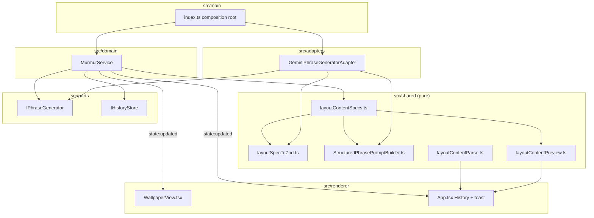

# Technical Spec: Structured phrase content per layout

| Field | Value |
|-------|-------|
| Status | Locked (implemented 2026-08-01) |
| Author | Murmur engineering |
| Created | 2026-08-01 |
| Updated | 2026-08-01 |
| Product spec | [functional-spec.md](./functional-spec.md) |
| Related | [RFC: Structured phrase generation](../../rfc-structured-phrase-generation.md), [architecture](../../architecture.md) |

## Summary

Replace the single-string phrase pipeline with **layout-bound structured content**: a registry defines fields per `LayoutStyleName`, `IPhraseGenerator.generateStructured` returns validated JSON payloads (Gemini + Zod), `MurmurService` persists and broadcasts them, and both **WallpaperView** and **NodeCanvasWallpaperPainterAdapter** render from payload keys instead of `phraseLayoutSplit` for tabloid, split-spread, and pull-quote. Classic layouts use the shared `{ phrase }` spec. History and tray keep backward compatibility via parse/normalize helpers.

**Complexity:** Medium–high (cross-cutting: port, adapter, domain, dual renderers, IPC state, history migration, E2E fixtures). One engineer, ~6 phased PRs.

**Infrastructure (v1, locked):**

| Area | Decision |
|------|----------|
| Runtime | Existing Electron app; **no new services** |
| Persistence | Same `userData` JSON files (`murmur.history.json`); entries become JSON strings |
| AI | **Gemini** via extended adapter; **Zod** already in `package.json` |
| Realtime | Existing `state:updated` IPC only |
| Feature flags | None; behavior always on when shipped |
| Ollama | **Interface-ready** only (no adapter v1) |

## Engineering principles (applied)

| Principle | Application |
|-----------|-------------|
| Hexagonal layering | Registry + Zod + prompt builder in `src/shared/` (pure); port in `src/ports/`; Gemini in adapter |
| Product truth | Functional spec AC drive tests and phases; no heuristic splits for structured layouts |
| Fail closed on bad AI output | Do not mutate `lastContent` / wallpaper state; surface `lastGenerationError` to Settings |
| Minimal IPC churn | Extend `MurmurState`; keep `history:get` → `string[]` with JSON-encoded entries |
| Dual render parity | Any layout change must update **CSS (WallpaperView)** and **canvas (NodeCanvasWallpaperPainterAdapter)** |
| E2E isolation | Stub `generateStructured` when `MURMUR_E2E=true`; structured fixture file for live capture |

## Architecture



### Module responsibilities

| Module | Responsibility |
|--------|----------------|
| `layoutContentSpecs.ts` | Map each `LayoutStyleName` → `LayoutContentSpec` (`schemaId`, `fields[]`) |
| `layoutSpecToZod.ts` | Build Zod object from spec; export `validateLayoutPayload(spec, unknown)` |
| `StructuredPhrasePromptBuilder.ts` | Spec + headlines + language + `buildPhraseFormattingRules` → user prompt |
| `layoutContentParse.ts` | Parse history/state strings: JSON object vs legacy plain string → normalized payload |
| `layoutContentPreview.ts` | Primary preview line per layout (headline, quote, left\|right snippet, phrase) |
| `payloadToPlainSummary.ts` | Derive tray / `lastPhrases` plain text from payload (strip markup) |
| `GeminiPhraseGeneratorAdapter` | `generateStructured`; JSON mode / `responseSchema` when SDK supports; field-level markdown validation |
| `MurmurService` | Resolve spec from config; call structured gen; persist; paint; tray; errors |
| `main/index.ts` | Hydrate `lastContent` from history on boot; E2E stub for structured fixtures |

## Auth & authorization

Not applicable (local desktop app). No new HTTP surface.

## HTTP API

None.

## Realtime / IPC

Existing channels only; extensions below.

| Channel | Change |
|---------|--------|
| `state:updated` | Payload `MurmurState` extended (see data model) |
| `history:get` | Still `Promise<string[]>`; each element is **normalized JSON string** for new saves; legacy plain strings unchanged on disk until read |
| `action:refresh` | Unchanged; failures set error on state |
| `config:save` | Unchanged; `layoutStyle` change still calls `refresh()` via `shouldRegeneratePhraseAfterConfigSave` |

**Renderer:** `App.tsx` subscribes to `state:updated`; when `lastGenerationError` transitions non-empty, show **error toast** (reuse existing toast UI). Clear error field on next successful refresh.

## Data model

### Layout content spec (code, not user-editable)

```ts
type LayoutFieldType = 'string' | 'markdown'

interface LayoutContentFieldSpec {
  key: string
  type: LayoutFieldType
  required: boolean
  description: string
  promptHint?: string
}

interface LayoutContentSpec {
  schemaId: string // e.g. murmur.layout.simple.v1
  layoutStyle: LayoutStyleName
  fields: LayoutContentFieldSpec[]
}
```

**v1 registry (locked with functional spec):**

| `layoutStyle` | `schemaId` | Fields |
|---------------|------------|--------|
| `centered`, `scattered`, `editorial-left`, `editorial-right`, `asymmetrical`, `book-cover` | `murmur.layout.simple.v1` | `phrase` (markdown, required) |
| `tabloid-stack` | `murmur.layout.tabloid.v1` | `headline` (markdown, required), `deck` (markdown, optional), `kicker` (string, optional) |
| `split-spread` | `murmur.layout.split-spread.v1` | `left` (markdown, required), `right` (markdown, required) |
| `pull-quote` | `murmur.layout.pull-quote.v1` | `quote` (markdown, required), `attribution` (string, optional) |

Export `getLayoutContentSpec(layoutStyle: LayoutStyleName): LayoutContentSpec`.

### Generation port

Extend `src/ports/IPhraseGenerator.ts`:

```ts
export interface PhraseGenerationRequest {
  headlines: string[]
  language: string
  systemPrompt: string
  contentSpec: LayoutContentSpec
  formatFlags: {
    enableBold: boolean
    enableItalic: boolean
    enableNewlines: boolean
    enableDifferentFonts: boolean
  }
}

export interface PhraseGenerationResult {
  schemaId: string
  layoutStyle: LayoutStyleName
  rawJson: string
  payload: Record<string, string>
}

export interface IPhraseGenerator {
  /** @deprecated path — remove after migration; delegate to structured + phrase field */
  generate(headlines: string[], language: string): Promise<string>
  generateStructured(request: PhraseGenerationRequest): Promise<PhraseGenerationResult>
}
```

`generate()` may remain temporarily as `generateStructured` with `getLayoutContentSpec('centered')` + return `payload.phrase` for tests; production **`MurmurService` uses only `generateStructured`**.

### MurmurState (`src/domain/types.ts`)

```ts
export interface LayoutContentEnvelope {
  schemaId: string
  layoutStyle: LayoutStyleName
  payload: Record<string, string>
}

export interface MurmurState {
  isPaused: boolean
  lastRefreshTime?: string
  /** Derived plain summary for tray / legacy UI */
  lastPhrases: Record<string, string>
  /** Authoritative structured content per monitor */
  lastContent: Record<string, LayoutContentEnvelope>
  lastHeadlines?: Record<string, string[]>
  lastSources?: Record<string, string[]>
  /** User-visible generation failure; cleared on success */
  lastGenerationError?: string
}
```

On successful refresh per screen: set `lastContent[id]`, set `lastPhrases[id] = payloadToPlainSummary(spec, payload)`, clear `lastGenerationError`. On validation failure after retries: **do not** update `lastContent` / `lastPhrases` for that attempt; set `lastGenerationError` to a safe message (no API key, no raw stack).

### PaintOptions

Add optional structured input (prefer explicit over cramming JSON into `phrase`):

```ts
export interface PaintOptions {
  phrase: string // keep for static paint fallback / transition; primary text for simple layouts = payload.phrase
  layoutContent?: LayoutContentEnvelope
  // ...existing fields
}
```

Canvas and static Instant path read `layoutContent` when present; `phrase` remains synced to plain summary or primary field for overlays that still key off `lastPhrases`.

### History store

Keep `IHistoryStore` shape:

```ts
save(monitorId: string, entry: string): Promise<void>
get(monitorId: string): Promise<string[]>
```

**Contract:** `save` writes `PhraseGenerationResult.rawJson` (normalized, validated JSON string). **Do not** append on failed generation.

**Read path:** `layoutContentParse.parseHistoryEntry(entry)` → `LayoutContentEnvelope | null` (legacy string → `{ schemaId: murmur.layout.simple.v1, layoutStyle: inferred or 'centered', payload: { phrase: entry } }` for display only; stored string unchanged).

Optional metadata (layout at generation time) is **inside** persisted JSON:

```json
{
  "schemaId": "murmur.layout.tabloid.v1",
  "layoutStyle": "tabloid-stack",
  "payload": { "headline": "…", "deck": "…" }
}
```

### Config

No schema migration. `layoutStyle` remains on `MurmurConfig`.

## Frontend

### WallpaperView.tsx

- Subscribe to `state.lastContent[monitorId]` (fallback: build envelope from `lastPhrases[monitorId]` as `{ phrase }` for boot/hydrate).
- **tabloid-stack / split-spread / pull-quote:** map payload keys to existing testids (`layout-tabloid-headline`, `layout-split-spread-left`, etc.); **remove** use of `splitPlainPhraseHeadlineDeck` / `splitFlatCharsAtWordMidpoint` for these layouts when `layoutContent` is present.
- **Classic layouts:** render `payload.phrase` through existing markup pipeline (same as today’s single phrase).
- Animation / phrase change detection: include serialized payload (or schemaId + payload hash) in deps, not only `lastPhrases`.

### NodeCanvasWallpaperPainterAdapter.ts

Mirror WallpaperView field mapping for static Instant / PNG path.

### App.tsx — Phrase History

- Local state: `historyViewMode: 'preview' | 'raw'` (toggle control).
- For each entry: `parseHistoryEntry` → Preview via `layoutContentPreview`, Raw via `JSON.stringify(envelope.payload, null, 2)` (or full stored JSON pretty-printed).
- Monitor selector unchanged.

### Tray

`ElectronTrayAdapter` continues using `lastPhrases` (derived summaries).

## Notifications

None beyond in-app Settings toast on `lastGenerationError`.

## Security checklist

- [ ] Error strings and history UI never include `geminiApiKey` or full provider responses with secrets
- [ ] Validated JSON only persisted (no unvalidated model output in history)
- [ ] Zod rejects unexpected keys if spec uses `.strict()` (recommended)

## Deployment

Standard Electron build; no env changes required beyond existing `GEMINI_API_KEY` / config file API key.

## Environment variables

| Variable | Change |
|----------|--------|
| `MURMUR_E2E` | Stub must implement `generateStructured` |
| `MURMUR_E2E_FIXTURE_PHRASE_PATH` | Fixture evolves to structured JSON (see Testing) |
| `MURMUR_E2E_REUSE_CAPTURED_PHRASE` | When true, layout-only config save skips `refresh()`; stub returns **layout-appropriate fixture** from registry defaults or embedded map (not one `{ phrase }` for tabloid) |

## Testing

| Layer | Scope |
|-------|--------|
| Unit | `layoutSpecToZod` (required/optional, reject bad shapes); `layoutContentParse` (legacy vs JSON); `layoutContentPreview`; `payloadToPlainSummary`; `StructuredPhrasePromptBuilder` snapshot; extend `MurmurService.test.ts` for success/failure/state/history |
| Unit | Gemini adapter: mock `@google/genai`; assert structured call uses spec; invalid JSON retries; markdown validation per field |
| Unit | Keep `phraseLayoutSplit` tests until module deleted or scoped to dead path only |
| Integration | Optional: MurmurService + mock generator → painter options include `layoutContent` |
| E2E | Update `magazine-layouts.spec.ts` stub payloads per layout; DOM assertions unchanged |
| E2E | `magazine-layouts-live-phrase.spec.ts`: capture fixture as structured JSON `{ layoutStyle, schemaId, payload }` at capture time; stub reads file |
| E2E | New or extended test: invalid stub payload → wallpaper text unchanged + error toast (mock generator in E2E-only hook or dedicated unit with IPC smoke) |
| Screenshots | `tests/e2e/artifacts/screenshots/structured-phrase-generation/` (or existing magazine slugs) per [architecture](../../architecture.md) |

**E2E stub behavior (locked):**

```ts
// When MURMUR_E2E=true, generateStructured(request):
// return fixed envelope matching request.contentSpec.layoutStyle
// from tests/e2e/fixtures/structured-phrases.json or inline map
```

Default map example: tabloid → fixed headline/deck; split-spread → fixed left/right; pull-quote → quote + attribution; simple → `{ phrase: fixturePhrase || 'stubbed…' }`.

**Live capture:** `captureLivePhrase.ts` saves full envelope from `state.lastContent` (after one real refresh), not only plain string.

## Implementation phases

| Phase | Deliverable | Files (primary) |
|-------|-------------|-------------------|
| 1 | Registry + Zod + parse/preview/summary helpers + unit tests | `src/shared/layoutContent*.ts`, `tests/unit/` |
| 2 | Port + `generateStructured` in Gemini adapter; markdown validation per `markdown` field | `IPhraseGenerator.ts`, `GeminiPhraseGeneratorAdapter.ts` |
| 3 | `MurmurService` structured path, state/history, failure handling, boot hydrate in `main/index.ts` | `MurmurService.ts`, `types.ts`, `index.ts` |
| 4 | WallpaperView + canvas render from payload; remove heuristic splits for structured layouts | `WallpaperView.tsx`, `NodeCanvasWallpaperPainterAdapter.ts` |
| 5 | History Preview \| Raw toggle; generation error toast | `App.tsx`, `preload` unchanged unless types exported |
| 6 | E2E fixtures + stubs; update `docs/architecture.md`; delete or narrow `phraseLayoutSplit` usage | `tests/e2e/**`, `appearanceRegenerate` comments |

Phases 1–4 satisfy core AC; 5–6 satisfy history, failure UX, and CI.

## Acceptance mapping

Maps to [functional-spec.md](./functional-spec.md) acceptance criteria:

| AC | Technical realization | Verification |
|----|------------------------|--------------|
| 1 Registry coverage | `layoutContentSpecs.ts` entries for all `LayoutStyleName` | Unit: spec count + keys; code review |
| 2 Generation | `MurmurService.refresh` → `getLayoutContentSpec` → `generateStructured` → Zod before state update | Unit MurmurService; integration mock |
| 3 Rendering (magazine) | Payload-driven branches in WallpaperView + canvas | E2E magazine specs + screenshots |
| 4 Classic layouts | `murmur.layout.simple.v1` + render `phrase` only | Unit + E2E centered layout |
| 5 Failure | Catch validation errors; skip history save; preserve state; `lastGenerationError` | Unit; E2E or renderer smoke with stub throwing |
| 6 History Preview | `layoutContentPreview` + toggle | E2E history tab or unit preview helpers |
| 7 History Raw | Pretty JSON from stored envelope | Unit parse + renderer |
| 8 History toggle | React state in App.tsx | E2E click toggle |
| 9 Legacy entries | `parseHistoryEntry` legacy branch | Unit JsonHistoryStore + parse |
| 10 Layout switch | Existing `appearanceRegenerate` + full refresh in prod | E2E config save layout change (stub returns new shape when reuse flag false) |
| 11 Tray/summary | `payloadToPlainSummary` → `lastPhrases` | Unit + tray adapter test if present |
| 12 No regression | Run full `npm run test:unit` + `npm run test:e2e` before complete | loop-build gate |

## Out of scope (technical)

- `OllamaStructuredPhraseGeneratorAdapter` implementation
- User-facing schema editor or IPC to edit specs
- Migrating on-disk history strings to JSON eagerly (normalize on read only)
- Gemini `responseSchema` if SDK version lacks it — fall back to prompt JSON + Zod (document in adapter comment)

## Open items (minor)

| Item | Default if unanswered |
|------|------------------------|
| Deprecate `IPhraseGenerator.generate` | Remove from MurmurService path in phase 3; keep for mocks until tests updated |
| `.strict()` vs strip unknown keys | Prefer **strict** Zod for v1 |
| Max JSON size in history | Same practical limit as today (~phrase length); no new cap |

---

**Next step:** Review **Infrastructure (v1, locked)** and **Implementation phases**, then **loop-build** against this doc and the locked functional spec. Update [RFC](../../rfc-structured-phrase-generation.md) status to “implementing” when phase 1 starts.
