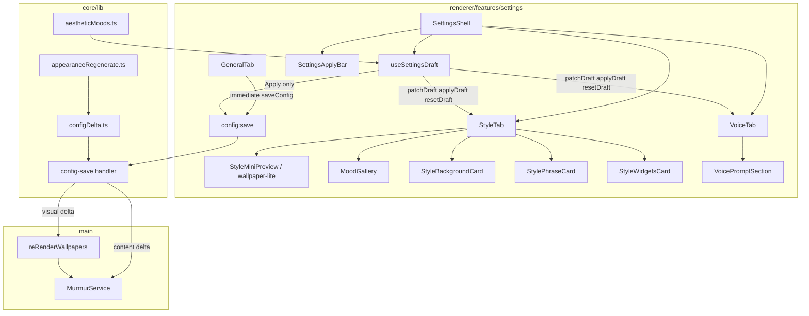

# Technical Spec: Style & Voice settings polish

| Field | Value |
|-------|-------|
| Status | **Locked** (2026-08-02) |
| Author | Murmur engineering |
| Created | 2026-08-02 |
| Updated | 2026-08-02 (preview architecture; locked) |
| Product spec | [functional-spec.md](./functional-spec.md) |
| Related | [architecture](../../architecture.md), [settings-ui-reorg technical spec](../settings-ui-reorg/technical-spec.md) (partial supersession) |

## Summary

Introduce a **unified Settings draft** for Style + Voice fields, **Apply / Reset** chrome, refactored Style IA (**Background → Phrase → Widgets**), richer controls (swatches, chips, segmented, layout thumbnails), and a **sticky mini preview** using a compact read-only wallpaper renderer. **`config:save`** side effects split into **visual re-render** vs **single Gemini refresh** based on a new core **config delta classifier**. Mood selection calls existing **`applyAestheticMood()`** into the draft only. Draft is backed by **`sessionStorage`** for same-session recovery. Remove immediate **`saveConfig`** / regeneration from Style and Voice controls; General, News sources, and Displays stay immediate.

**Complexity:** Medium–high (renderer state machine + config-save orchestration + WallpaperView extraction + broad E2E updates).

**Infrastructure (v1, locked):**

| Area | Decision |
|------|----------|
| Runtime | Existing Electron app |
| Config persistence | Unchanged `murmur.config.json` via `JsonConfigStoreAdapter.set(partial)` |
| Draft persistence | **`sessionStorage`** key `murmur.settingsDraft.v1` (JSON snapshot of draft + dirty flag metadata); cleared on successful Apply or explicit Reset |
| Mini preview | **Wallpaper-lite** — extract shared layout/render logic from `WallpaperView` into a read-only compact component |
| IPC | **No new channels**; continue `config:save` with merged partial/full draft payload on Apply |
| Feature flags | None |
| New npm deps | None |

## Engineering principles (applied)

| Principle | Application |
|-----------|-------------|
| Functional spec is product truth | Draft scope, Apply semantics, and AC drive hooks and `config-save` branching |
| Hexagonal boundaries | Delta classification and mood apply remain in `@core/lib`; renderer never imports `@main` |
| Single mood source | `applyAestheticMood()` for Style mood cards and mood-linked Voice presets (draft merge only) |
| Fail closed on invalid draft | Apply validates Zod-equivalent rules (e.g. `tonePreset: 'custom'` requires non-empty `customToneText`) before IPC |
| Server authority | Main process decides re-render vs `refresh()` after persist; renderer cannot skip regeneration by bypassing handler |
| Minimal IPC churn | Reuse `config:save`; optional future `config:apply` not needed if Apply sends one merged partial |
| E2E as contract | New feature spec `tests/e2e/style-voice-settings-polish.spec.ts` + npm script |

## Architecture



### Module responsibilities

| Module | Responsibility |
|--------|----------------|
| `core/lib/presets/configDelta.ts` | **New.** `DRAFT_FIELD_KEYS`, `classifyConfigDelta(prev, next): 'none' \| 'visual' \| 'content'`, helpers `pickDraftFields`, `draftFieldsEqual` |
| `core/lib/presets/appearanceRegenerate.ts` | **Refactor** to delegate content check to `classifyConfigDelta`; keep E2E `MURMUR_E2E_REUSE_CAPTURED_PHRASE` behavior |
| `core/lib/presets/aestheticMoods.ts` | Unchanged API; used for draft mood merge + active mood detection against **draft** config |
| `renderer/.../hooks/useSettingsDraft.ts` | **New.** Unified draft state, sessionStorage sync, dirty detection, `applyDraft`, `resetDraft`, `applyMoodToDraft`, merge on `config:updated` |
| `renderer/.../components/SettingsApplyBar.tsx` | **New.** Apply / Reset; rendered from `SettingsShell` when dirty |
| `renderer/.../components/StyleMiniPreview.tsx` | **New.** Wallpaper-lite preview (see Frontend) |
| `renderer/.../components/SettingsChipGroup.tsx`, `SettingsSegmentedControl.tsx` | **New.** Shared selection UI |
| `renderer/.../tabs/Style*.tsx` | Replace `AppearanceTab` embedding with three section components |
| `renderer/.../hooks/useSystemPromptDraft.ts` | **Remove** or fold into `useSettingsDraft` |
| `renderer/.../hooks/useMoodChange.ts` | **Replace** with draft mood handler (no `saveConfig`) |
| `main/ipc/handlers/config-save.ts` | Branch on `classifyConfigDelta`; call `reRenderWallpapers` vs `refresh()` once |

## Auth & authorization

Not applicable (local desktop).

## HTTP API

None.

## Realtime / IPC

| Channel | Change |
|---------|--------|
| `config:save` | Unchanged signature. Apply sends one partial object covering all draft fields (see Data model). Handler uses **delta classification** after merge persist. |
| `config:get`, `config:updated`, `state:updated` | Unchanged |
| `action:refresh` | Unchanged (explicit Refresh Now still runs full pipeline) |

Preload / `window-api.d.ts`: no API surface change required.

## Data model

### Draft field keys (single source in `configDelta.ts`)

Keys included in unified draft (must match functional spec):

```text
theme, noiseIntensity, vignetteStyle,
fontFamily, textAlignment, layoutStyle, animation, audioFeedback,
overlays,
systemPrompt, tonePreset, customToneText, language,
enableBold, enableItalic, enableNewlines, enableDifferentFonts,
headlineSampleSize
```

**Not** in draft (immediate save paths): `geminiApiKey`, `feeds`, `refreshIntervalMinutes`, `launchAtLogin`, `monitors`, etc.

**Mood UI state:** Store `draftSelectedMoodId: AestheticMoodId | null` in draft hook state (not persisted to config file). Used for card highlight. On Apply, config equivalence determines active mood via existing `isAestheticMoodActive`.

### sessionStorage payload (`murmur.settingsDraft.v1`)

```typescript
type SettingsDraftStorage = {
  version: 1
  draft: MurmurConfig // full config snapshot (includes non-draft keys copied from last committed baseline)
  committedRevision: string // hash or updatedAt: JSON.stringify pick committed draft keys for equality
  savedAt: number
}
```

On Settings mount: if storage exists and `committedRevision` matches current committed draft-key slice, hydrate draft; else discard storage.

On successful Apply: update storage to clean state or remove entry.

### Config delta classification (locked)

| Classification | Fields triggering **content** (any change → at most one `refresh()` on Apply) |
|----------------|----------------------------------------------------------------------------------|
| **Content** | `systemPrompt`, `tonePreset`, `customToneText`, `language`, `layoutStyle`, `enableBold`, `enableItalic`, `enableNewlines`, `enableDifferentFonts`, `headlineSampleSize` |
| **Visual** | `theme`, `fontFamily`, `textAlignment`, `animation`, `audioFeedback`, `noiseIntensity`, `vignetteStyle`, `overlays` |
| **None** | No draft-key delta |

**Rules:**

- If both visual and content change in one Apply → **content wins** → exactly **one** `refresh()`.
- Visual-only Apply → **no** `refresh()`; call **`reRenderWallpapers(state)`** (new service method, see below).
- Delta **none** (Apply clicked but no draft-key changes): skip side effects; optional quiet toast or no toast.

**Migration from today’s `appearanceRegenerate.ts`:**

- Remove `theme`, `fontFamily`, `animation`, `textAlignment` from content triggers (move to visual-only).
- Keep `layoutStyle`, markup flags, prompt, tone, language, sample size as content.
- E2E `MURMUR_E2E_REUSE_CAPTURED_PHRASE`: when enabled, **layout-only** content delta still skips live Gemini per existing test contract; implement inside classifier or handler special case (preserve current test README behavior).

### Mood merge rules

1. **`applyMoodToDraft(moodId)`** — `draft = { ...draft, ...applyAestheticMood(moodId) }`; set `draftSelectedMoodId = moodId`; sync prompt text in draft for Voice tab.
2. **Manual edit after mood** — field-level last write wins on draft; `draftSelectedMoodId` becomes `null` if draft no longer matches `applyAestheticMood(id)` for any id (use `isAestheticMoodActive(draft, id)` helper extended for partial mismatch → Custom).
3. **Voice mood-linked preset** — same as mood: merge `applyAestheticMood` into draft + prompt; **no** save.
4. **Standalone prompt preset** — updates `draft.systemPrompt` only.

### `config:updated` merge (General save while dirty)

When IPC fires `config:updated` with fresh committed config:

```typescript
setDraft((d) => ({
  ...freshCommitted,
  ...pick(d, DRAFT_FIELD_KEYS)
}))
setCommitted(freshCommitted)
```

Non-draft keys on disk update immediately; pending Style/Voice edits remain until Apply or Reset.

## Frontend

### `useSettingsDraft`

| API | Behavior |
|-----|----------|
| `draft` | Full `MurmurConfig` working copy |
| `isDirty` | `!draftFieldsEqual(committed, draft)` |
| `patchDraft(partial)` | Merge partial into draft keys only |
| `applyMoodToDraft(id)` | Mood bundle merge |
| `applyDraft()` | Validate → build partial from draft keys → `api.saveConfig` → on success clear dirty storage |
| `resetDraft()` | Restore draft from `committed` |
| `committed` | Last known from `config:updated` / initial get |

Remove `useMurmurConfig.saveConfig` from Style/Voice tabs; pass `patchDraft` instead. General/News/Displays keep `saveConfig`.

### Apply bar & navigation guards

- **`SettingsApplyBar`**: fixed bottom of main column or below header when `isDirty`; buttons **Apply changes** / **Reset draft**; duplicate placement not needed on both tabs if bar is global in shell (visible on Style **and** Voice when dirty — functional AC).
- **Tab change**: if `isDirty`, `window.confirm` or small modal (match existing app tone): Discard / Stay.
- **Settings window close**: `beforeunload` equivalent in Electron — use `window.onbeforeunload` in Settings renderer when dirty.

### Style tab structure

| Component | Controls |
|-----------|----------|
| `StyleMiniPreview` | Sticky top within Style scroll area; props: `draftConfig`, `phrase`, `layoutContent` from `state` (primary monitor) |
| `MoodGallery` | `draftConfig` for active ring; `onSelect` → `applyMoodToDraft` |
| `StyleBackgroundCard` | Theme swatches, grain chips, vignette chips |
| `StylePhraseCard` | Font preview selector, alignment segmented, layout thumbnail grid + `SettingsSelect` fallback, **Motion** subsection: animation chips + audio toggle |
| `StyleWidgetsCard` | Three overlay toggles (unchanged copy) |

Deprecate top-level `AppearanceTab.tsx` route usage; delete or re-export internals after migration.

### Renderer preview architecture (aligned with [architecture.md](../../architecture.md))

Murmur has **live overlay** (`WallpaperView` in a wallpaper `BrowserWindow`), **static paint** (main canvas → OS wallpaper), and **lightweight text preview** (`layoutContentPreview` in History). The Style mini preview is a **fourth tier**: in-settings, high-fidelity **CSS/React** preview — not a second Electron window and not IPC desktop paint.

| Approach | Use for Style draft preview? | Reason |
|----------|------------------------------|--------|
| In-renderer React (wallpaper-lite) | **Yes (v1)** | Same bundle, draft config via props, no Gemini/save |
| Second `BrowserWindow` / `?view=wallpaper` | **No** | Lifecycle/z-index; committed wallpaper listens to disk `config:updated`, not draft |
| `action:previewTheme` on draft change | **No** | Paints **real monitor** — keep for Displays monitor theme try-on only |
| Main-process canvas per draft tick | **No** | Heavy; canvas path is for desktop **Instant/PNG parity**, not Settings UI |
| `@main` / infrastructure in renderer | **No** | ESLint process boundaries |

**Module split (locked):**

```text
renderer/features/wallpaper/
  WallpaperView.tsx                 # full route: IPC subscriptions, viewport, animations
  WallpaperPreviewContent.tsx       # shared presentational tree (layouts, theme, phrase)
  wallpaperThemeStyles.ts           # optional pure theme/CSS helpers

renderer/features/settings/components/
  StyleMiniPreview.tsx              # sticky chrome, scale/aspect, data-testid; wires props only
```

| Layer | Responsibility |
|-------|----------------|
| `StyleMiniPreview` | Settings-only framing (~360×200, sticky, read-only, `data-testid="style-mini-preview"`) |
| `WallpaperPreviewContent` | Same layout branches as `WallpaperView`; **no** `window.api` |
| `@core/lib` | Phrase markup, layout specs, `layoutContentPreview` where text-only suffices |

**Data flow:** `draftConfig` + committed `state.lastPhrases` / `state.lastContent` (primary monitor) passed as props — no IPC during draft edits. New layouts still require **WallpaperView + canvas painter** parity on the real desktop; preview **imports shared** layout map from `wallpaper/` to avoid drift.

Refactor: extract prop-driven subtree from `WallpaperView`; `WallpaperView` retains listeners + animation; preview shows **static post-layout frame** (no animation loop in v1).

### Style mini preview (wallpaper-lite)

1. Implement **`WallpaperPreviewContent`** under `renderer/features/wallpaper/` per table above.
2. **`StyleMiniPreview.tsx`** composes it with `pointer-events-none`, scaled container.
3. Uses **committed** phrase/content; **draft** config for visual fields.
4. Optional subtitle under preview: “Preview uses your current phrase; Apply to update the desktop.”

### Voice tab changes

- Remove separate **Apply** on system prompt; remove `isPromptDirty` / checkmark UX.
- Preset dropdown + textarea bound to `draft.systemPrompt` via `patchDraft`.
- Tone chips + language select on **one row** (`grid grid-cols-2 gap-4` or flex).
- Markup + Advanced sample size → `patchDraft`.

### Shared UI components

| Component | Props pattern |
|-----------|-----------------|
| `SettingsChipGroup<T>` | `options: { value, label }[]`, `value`, `onChange` |
| `SettingsSegmentedControl<T>` | 3-way alignment icons + labels |
| `ThemeSwatchGrid` | theme names + gradient classes from existing theme map |
| `LayoutThumbnailPicker` | grouped Classic / Magazine; thumbnail + `data-testid` per layout |

Reuse `SettingsSelect` only where fallback required (layout overflow, language list).

## Main process: `config-save` orchestration

After `configStore.set(merged)`:

```typescript
const deltaKind = classifyConfigDelta(prevConfig, newConfig)
broadcast configUpdated // existing

if (!newConfig.geminiApiKey) return

switch (deltaKind) {
  case 'none':
    break
  case 'visual':
    await murmurService.reRenderWallpapers(getState())
    break
  case 'content':
    await murmurService.refresh({ lastContent, lastPhrases })
    break
}
```

### `MurmurService.reRenderWallpapers`

- **New public method** (or rename/clarify `updateClockWallpapers`):
  - For **`animation === 'Instant'`**: existing paint path (`updateClockWallpapers`).
  - For **live overlay**: broadcast `config:updated` already sent; ensure background `BrowserWindow`(s) re-render from cached phrase/content with new config (existing wallpaper listeners — verify and fix if any field ignored).
- **Do not** call RSS or `IPhraseGenerator`.

### Toasts (renderer)

`useMurmurConfig` / `applyDraft` success handler:

| Outcome | Message |
|---------|---------|
| Visual-only delta | “Look updated.” |
| Content delta | “Phrase regenerated for your new settings.” |
| Save error | Existing error toast |

No success toast on individual `patchDraft` calls. Remove tone-only immediate toast from old `saveConfig`.

## Notifications

Toast only after Apply (see above). No tray notifications added.

## Security checklist

- [ ] Draft sessionStorage contains no secrets beyond what is already in config (API key remains in committed config; draft copy inherits — acceptable same as today’s in-memory config).
- [ ] No new `openExternal` or network surface.
- [ ] Validate draft on Apply before write (schema parse in main already on set).

## Deployment

Ship with normal app release; no env vars required. Existing `MURMUR_E2E*` vars preserved for regression.

## Environment variables

| Variable | Effect |
|----------|--------|
| `MURMUR_E2E` | Stub adapters unchanged |
| `MURMUR_E2E_REUSE_CAPTURED_PHRASE` | Layout-only content delta behavior preserved in handler/classifier |

## Testing

| Layer | Scope |
|-------|--------|
| **Unit** | `configDelta.test.ts`: visual vs content vs none; mood parity `applyAestheticMood` + Apply equivalence; refactor `appearanceRegenerate.test.ts` |
| **Unit** | `useSettingsDraft` logic extracted to pure `settingsDraft.ts` where testable (dirty, session merge, config updated merge) |
| **Unit** | `config-save` handler with mocked `MurmurService`: assert `refresh` call count 0/1, `reRenderWallpapers` on visual |
| **E2E** | `style-voice-settings-polish.spec.ts`: open Style, change theme swatch N times → Apply → assert stub `generateStructured` / refresh call count (wrap E2E phrase generator with counter in `e2e-overrides.ts` optional `generationCallCount` on state for test read via `getState` if needed); mood select + Apply config parity snapshot |
| **E2E** | Dirty guard: change draft, attempt tab switch → confirm |
| **E2E** | Screenshots: Style with preview + three cards; Voice tone row |
| **Regression** | Update `settings-ui-reorg.spec.ts` for new Structure; run full suite before COMPLETE |

### E2E generation counter (recommended)

Wrap stub `IPhraseGenerator` in `createE2eRuntimeAdapters()` with incrementing counter; expose via optional field on `MurmurState` in E2E only (`lastGenerationCallCount`) or log line matched by Playwright — prefer state field for stability.

## Implementation phases

| Phase | Deliverable |
|-------|-------------|
| **1 — Core delta** | `configDelta.ts`; refactor `appearanceRegenerate.ts`; unit tests; update `config-save.ts` with `reRenderWallpapers` path |
| **2 — Draft hook** | `useSettingsDraft`, sessionStorage, Apply/Reset bar, navigation guards; wire SettingsShell |
| **3 — Style IA** | Background / Phrase / Widgets components; mood draft; remove AppearanceTab from Style |
| **4 — Controls** | Swatches, chips, segmented, layout thumbnails, font preview |
| **5 — Mini preview** | Extract wallpaper-lite; sticky StyleMiniPreview |
| **6 — Voice** | Tone chips, row layout; remove prompt Apply; all draft |
| **7 — E2E + docs** | Feature spec tests, update loop-state, screenshot manifest |

Suggested branch: `feature/style-voice-settings-polish`.

## Acceptance mapping

Maps to [functional-spec.md](./functional-spec.md) acceptance criteria:

| AC | Implementation / test |
|----|------------------------|
| 1 | StyleBackgroundCard, StylePhraseCard (+ Motion), StyleWidgetsCard order |
| 2 | `applyMoodToDraft` merges prompt + tone + visuals; E2E mood draft + no disk write until Apply |
| 3 | `applyDraft` / `resetDraft` + sessionStorage sync |
| 4 | E2E counter: 0 generator calls during patchDraft interactions |
| 5 | Unit + E2E: theme-only Apply → `refresh` not called, reRender called |
| 6 | Unit + E2E: tone or layout Apply → exactly one `refresh` |
| 7 | Unit: compare `applyAestheticMood(id)` with Apply result object deep equal |
| 8 | StyleMiniPreview + state phrase/content |
| 9 | VoiceTab UI + no `handleApplyPrompt` |
| 10 | Tab change + beforeunload confirm when `isDirty` |
| 11 | Toast messages in `applyDraft` success path |
| 12 | Preset/tone/language handlers call `patchDraft` only |

## Out of scope (technical)

- Draft/Apply for General, News, Displays.
- IPC `config:applyDraft` channel.
- Pixel-perfect animated preview in mini view.
- Persisting draft to disk across app restarts (sessionStorage only).

## Open items (minor)

- [ ] Exact confirm dialog component vs `window.confirm` (prefer shared modal if one exists).
- [ ] Whether `headlineSampleSize` change without other content fields should regen (classified **content** — yes).

## Product ↔ engineering locks (confirmed)

| Topic | Lock |
|-------|------|
| Mini preview | Wallpaper-lite component extracted from `WallpaperView` |
| Draft persistence | `sessionStorage` `murmur.settingsDraft.v1` |
| Mood on Apply | Full `applyAestheticMood()` bundle including prompt + tone |
| Regeneration | Only on Apply; at most one `refresh()` when content delta |
