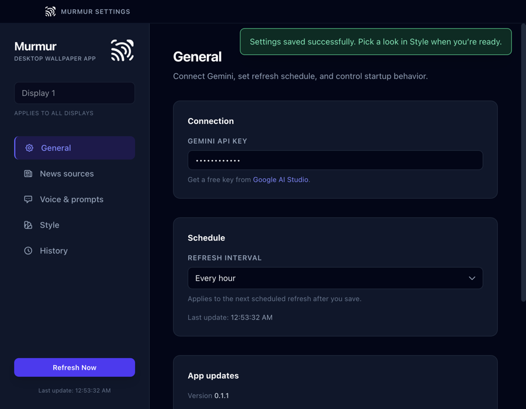
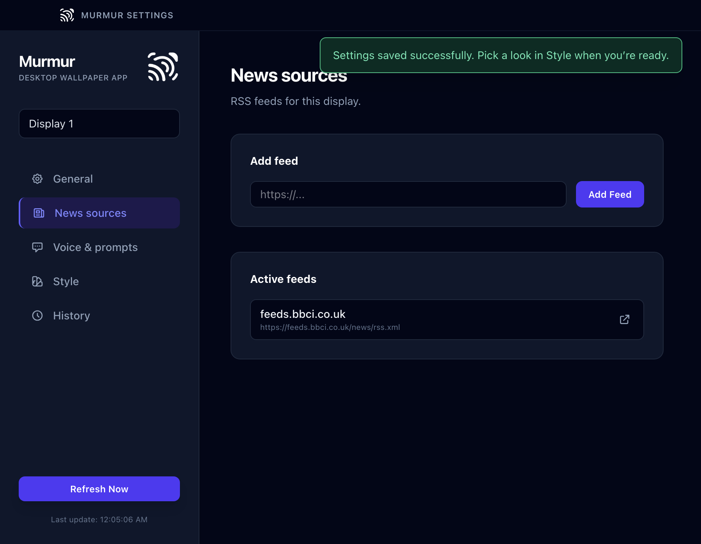
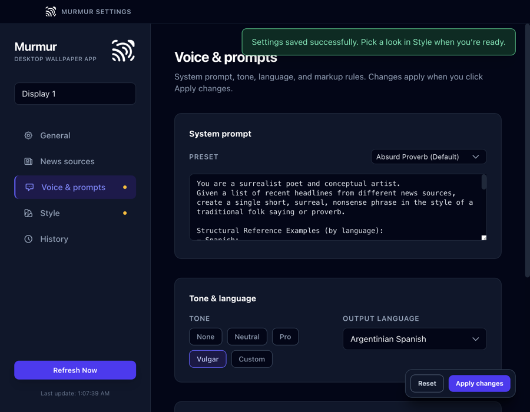
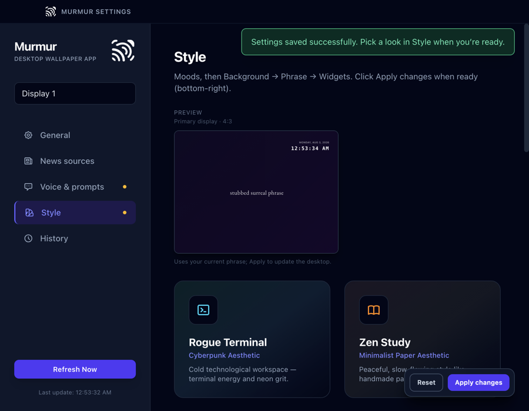
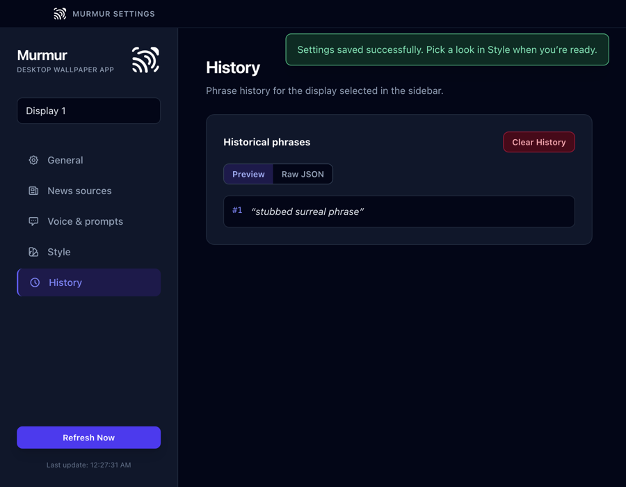

# Configuration

All settings are edited in the **Murmur Settings** window (menu bar / tray → **Settings**).

| Area | How changes are saved |
|------|------------------------|
| **General** | Saves as you edit (API key, interval, launch at login) |
| **News sources** | Saves immediately when you add or remove a feed (per display) |
| **Voice & prompts** and **Style** | Edits stage a draft; use the bottom **Apply changes** bar to commit (or **Reset** to discard) |

## Settings tabs

### General

Applies to the **whole app** (all displays):

- **Gemini API key** — required for refresh; password field
- **Refresh interval** — how often Murmur fetches feeds and regenerates
- **Launch at login** — start Murmur when you sign in
- **App updates** — version, status, **Check for updates**, **Restart to update** (Windows release builds), **Download from GitHub** (macOS when a newer release exists), **Manual download** link

### News sources

RSS feed URLs Murmur fetches on each refresh. Failed feeds are skipped; generation uses whatever titles were retrieved.

### Voice & prompts

Controls how Gemini writes from headline text:

- **Prompt preset** and custom **system prompt**
- **Tone** and **output language**
- Markup and advanced options where exposed in the UI

Per-display when multiple monitors are configured (see below).

### Style

**Aesthetic moods** (e.g. Zen Study, Rogue Terminal) bundle theme, font, layout, and animation. You can customize further after choosing a mood.

Select a mood or tweak appearance, click **Apply changes**, then use **Refresh Now** to regenerate the phrase with the new look.

### History

Recent generated phrases for the **selected display**, with preview or raw JSON for structured layouts.

## Multiple displays

When more than one monitor is connected, the sidebar **display selector** chooses which profile you edit for **News sources**, **Voice & prompts**, **Style**, and **History**.

**General** always applies globally.

With **two or more displays**, each tab can show a **sync** icon to keep that tab aligned across displays that share sync, and the sidebar has a **sync all tabs** control next to the display selector. Tooltips in the UI describe each control.

## Menu bar / tray

From the menu bar (macOS) or system tray (Windows) you can open **Settings**, **Refresh Now**, or **Quit**. Wallpaper may render as a live overlay or a painted image depending on platform and animation settings (see [architecture.md](../architecture.md)).

## Related

- [Getting started](getting-started.md)
- [Architecture](../architecture.md) — config file names and adapter behavior
